# Audit technique et refonte design de FinScope

> Rapport progressif unique — PHASES 1 et 2, arrêtées au 30 août 2026, puis remédiation vérifiée dans le code au 31 août 2026. Les phases 3 à 5 ne sont pas commencées.

## Statut des assertions

- **FAIT CONSTATÉ** : vérifié dans le code local, par recherche statique exhaustive dans les fichiers suivis par Git, ou par une requête explicitement décrite.
- **HYPOTHÈSE** : aucune dans cette phase.
- **RECOMMANDATION** : aucune dans cette phase ; le diagnostic commence seulement après validation de la cartographie.
- **NON VÉRIFIÉ** : limites explicites regroupées en fin de phase.

---

# PHASE 1 — Cartographie

## 1. Périmètre et méthode

**FAIT CONSTATÉ — périmètre audité.** Le dépôt contient 172 fichiers suivis par Git. L'inventaire statique a porté sur l'intégralité de ces fichiers ; les répertoires générés ou locaux `node_modules/`, `.next/`, `.vinext/`, `dist/` et `.wrangler/` étaient présents sur la machine mais ont été exclus de la lecture ligne par ligne conformément aux exclusions du dépôt (`.gitignore:3-19`, `.gitignore:39-42`).

**FAIT CONSTATÉ — volumétrie du code métier.** Le dépôt suivi contient 24 composants React, 50 fichiers sous `lib/`, 38 tests et 11 routes API. Ces nombres proviennent de l'énumération locale des fichiers ; la liste des routes est recoupée par leur présence sous `app/api/` et par les imports/adaptateurs cités ci-dessous.

**FAIT CONSTATÉ — vérification réseau ponctuelle.** Le 30 août 2026, des GET non mutants ont répondu `200` sur les cinq contrats externes utilisés par le code : SEC Company Facts, registre SEC des tickers, SEC Submissions, Yahoo Chart et Yahoo Spark. Les réponses observées étaient du JSON ; le sondage AAPL a renvoyé les espaces `dei` et `us-gaap` côté SEC, cinq timestamps côté Yahoo Chart et deux résultats pour deux symboles côté Yahoo Spark. Il s'agit d'un constat ponctuel, pas d'une garantie de disponibilité future. Les URL et schémas attendus sont ceux déclarés dans `lib/adapters/sec.ts:7-16`, `lib/adapters/sec.ts:425-442`, `lib/adapters/sec.ts:450-490`, `lib/adapters/yahoo.ts:4-20`, `lib/adapters/yahoo.ts:64-86` et `lib/adapters/quotes.ts:17-35`, `lib/adapters/quotes.ts:65-95`.

## 2. Arborescence réelle

**FAIT CONSTATÉ — arborescence logique des fichiers suivis.** Les fichiers générés cités plus haut ne sont pas reproduits individuellement.

```text
FinScope-GitHub/
├── .claude/launch.json
├── .env.example
├── .openai/hosting.json
├── app/
│   ├── api/
│   │   ├── company/[ticker]/route.ts
│   │   ├── freshness/route.ts
│   │   ├── fx/route.ts
│   │   ├── indices/route.ts
│   │   ├── market/[ticker]/route.ts
│   │   ├── movers/route.ts
│   │   ├── performance/route.ts
│   │   ├── price/[ticker]/route.ts
│   │   ├── prices/[ticker]/route.ts
│   │   ├── resolve/route.ts
│   │   └── watchlist/route.ts
│   ├── chatgpt-auth.ts
│   ├── globals.css
│   ├── layout.tsx
│   └── page.tsx
├── build/sites-vite-plugin.ts
├── components/                 # 24 composants React
│   ├── FinanceApp.tsx          # shell, navigation, fiche société
│   ├── HomePage.tsx            # watchlist
│   ├── ChartsWorkspace.tsx
│   ├── MarketPage.tsx
│   ├── PortfolioPage.tsx
│   ├── QsScreener.tsx
│   └── ...                     # 18 autres composants
├── db/
│   ├── index.ts
│   └── schema.ts
├── docs/
│   ├── FORMULAS.md
│   ├── LIMITATIONS.md
│   ├── SOURCES.md
│   └── VALIDATION.md
├── drizzle/meta/_journal.json
├── examples/d1/               # exemple opt-in, hors application active
├── lib/                        # 50 fichiers
│   ├── adapters/
│   │   ├── intraday.ts
│   │   ├── quotes.ts
│   │   ├── sec.ts
│   │   └── yahoo.ts
│   ├── qs/                     # moteur JS historique du screener
│   ├── dataset-cache.ts
│   ├── market-cache.ts
│   ├── periods.ts
│   ├── finance.ts
│   ├── demo-data.ts
│   ├── types.ts
│   └── ...                     # calculs, graphiques, qualité, DCF
├── public/
│   ├── qs/                     # version statique autonome du screener
│   ├── favicon.svg
│   └── og.png, autres assets
├── tests/                      # 38 fichiers, dont un test d'intégration .mjs
├── worker/index.ts
├── drizzle.config.ts
├── eslint.config.mjs
├── next.config.ts
├── postcss.config.mjs
├── tsconfig.json
├── vite.config.ts
├── vitest.config.ts
├── package.json
└── package-lock.json
```

## 3. Stack réellement utilisée

| Couche | FAIT CONSTATÉ | Preuve |
|---|---|---|
| Runtime | Node.js `>=22.13.0` pour les outils et Cloudflare Worker pour l'exécution déployée | `package.json:5-6`, `worker/index.ts:38-39`, `worker/index.ts:72-99` |
| Framework web | Sémantique Next.js App Router fournie par `vinext`, construite avec Vite | `package.json:8-15`, `package.json:46-47`, `vite.config.ts:1-4`, `vite.config.ts:69-80` |
| Frontend | React 19.2.6 / React DOM 19.2.6 ; composants client interactifs | `package.json:20-21`, `components/FinanceApp.tsx:159-190` |
| Langage | TypeScript strict, avec JavaScript autorisé pour le moteur QS historique | `tsconfig.json:3-15`, `lib/qs/qs-engine.js:1`, `public/qs/js/qs-engine.js:1` |
| Graphiques / icônes | Recharts 3 et Lucide React | `package.json:19-23`, `components/CompanyKpiGrid.tsx:3-7` |
| Validation runtime | Zod valide les payloads SEC et Yahoo principaux | `package.json:23`, `lib/adapters/sec.ts:7-16`, `lib/adapters/yahoo.ts:4-20`, `lib/adapters/quotes.ts:17-35` |
| Styles | Feuille CSS applicative à variables ; Tailwind/PostCSS est installé et configuré, mais aucun `@import`/`@tailwind` n'est présent dans les sources applicatives | `app/globals.css:21-80`, `postcss.config.mjs:1-5`, `package.json:30`, `package.json:43` |
| Hébergement | Cloudflare Workers via le plugin Vite Cloudflare ; assets statiques et transformation d'images au niveau Worker | `package.json:26-27`, `package.json:49`, `vite.config.ts:67-79`, `worker/index.ts:38-53` |
| Cache serveur | Cloudflare KV, binding `DATASET_CACHE`, pour datasets, digests, prix et historiques | `vite.config.ts:14-16`, `vite.config.ts:30-31`, `lib/runtime-env.ts:9-24`, `lib/market-cache.ts:93-118` |
| Base relationnelle | Drizzle/D1 est scaffoldé mais n'est pas actif : schéma vide et binding D1 désactivé dans la configuration d'hébergement | `db/schema.ts:1-4`, `.openai/hosting.json:1-4`, `db/index.ts:5-13` |
| Stockage objet | R2 est supporté conditionnellement par la configuration, mais désactivé (`null`) | `.openai/hosting.json:3-4`, `vite.config.ts:49-56` |
| Tests / qualité | Vitest, TypeScript, ESLint et un smoke test HTML post-build sont configurés | `package.json:12-15`, `vitest.config.ts:4-15`, `eslint.config.mjs:10-39` |

**FAIT CONSTATÉ — rendu initial.** La page racine est forcée statique et rend une fixture Apple embarquée ; après hydratation, le client demande `/api/company/:ticker` et remplace la fixture si la requête aboutit (`app/page.tsx:4-26`, `components/FinanceApp.tsx:195-220`).

## 4. Sources de données externes

### 4.1 Fondamentaux et registre réglementaire

| Source | Usage et format | Fréquence de lecture / cache effectif | Gestion des erreurs |
|---|---|---|---|
| **SEC EDGAR Company Facts** `data.sec.gov/api/xbrl/companyfacts/CIK….json` | JSON XBRL normalisé ; validation Zod de `entityName`, namespaces, concepts, unités et faits ; sert les états financiers | Sur absence ou reconstruction KV. Dataset KV conservé 7 jours, éligible à reconstruction après 20 h. Cron à 01:00, 07:00, 13:00, 19:00 UTC, budget de 6 reconstructions par passage. Réponse HTTP de `/api/company` : `s-maxage=3600`, SWR 24 h | Statut SEC non-2xx → exception ; schéma invalide → `ZodError`; route → JSON `502`. Les erreurs d'écriture/lecture KV sont absorbées et la source directe reste tentée |
| **SEC company_tickers.json** | Objet JSON indexé contenant `cik_str`, `ticker`, `title`; recherche et résolution des sociétés hors registre local | Le fetch porte une intention `revalidate: 86400`; `/api/resolve` annonce `s-maxage=86400` | Non-2xx → exception puis `/api/resolve` renvoie `502`; la forme du registre est castée, pas validée par Zod |
| **SEC Submissions** `data.sec.gov/submissions/CIK….json` | JSON validé par Zod ; lit les tableaux `form`, `filingDate`, `reportDate`, `accessionNumber` pour contrôler la fraîcheur | Aucun cache applicatif déclaré ; `/api/freshness` est `no-store`, limité à 6 tickers par requête | L'échec d'un ticker devient une ligne `status: "unknown"` avec motif ; les autres lignes continuent |

Preuves : `lib/adapters/sec.ts:7-16`, `lib/adapters/sec.ts:103-134`, `lib/adapters/sec.ts:425-446`, `lib/adapters/sec.ts:450-504`, `lib/dataset-cache.ts:81-93`, `lib/dataset-cache.ts:134-149`, `lib/dataset-cache.ts:431-493`, `vite.config.ts:21-31`, `app/api/company/[ticker]/route.ts:17-20`, `app/api/company/[ticker]/route.ts:104-123`, `app/api/resolve/route.ts:4-8`, `app/api/freshness/route.ts:15-17`, `app/api/freshness/route.ts:44-74`.

### 4.2 Marché, prix et change

| Source | Usage et format | Fréquence de lecture / cache effectif | Gestion des erreurs |
|---|---|---|---|
| **Yahoo Chart v8 — sessions journalières** | JSON validé par Zod ; timestamps et tableaux OHLCV/adjusted close. Sert prix ponctuels, lots de dates, historiques, performance et paires FX | `/api/price`, `/api/prices`, `/api/market`, `/api/performance` utilisent KV : 5 min si la fenêtre inclut aujourd'hui, 24 h sinon. Une réponse partielle de `/api/prices` ne reste que 60 s ; une réponse vide n'est pas stockée. `/api/fx` n'utilise ni KV ni en-tête de cache explicite | Deux bases tentées (`query1`, puis `query2`). Non-2xx ou absence de résultat → erreur. Selon la route : `502`, erreur par date, ou erreur par ligne |
| **Yahoo Chart v8 — intraday / fenêtres d'indices** | JSON validé par un schéma séparé ; barres 5 min à hebdomadaires selon la fenêtre ; sert les trois indices de la page Marché | Pas de KV dans cette route. Cache HTTP : 30 s, SWR 120 s | Chaque indice échoué est conservé comme entrée avec `error`; `502` seulement si aucun indice n'est utilisable |
| **Yahoo Spark v7** | JSON validé par Zod ; prix courant et clôture précédente pour plusieurs symboles ; sert la heatmap | Pas de KV dans cette route. Cache HTTP : 60 s, SWR 300 s. Lots de 20 symboles exécutés séquentiellement | Un lot refusé est omis ; la réponse expose les nombres demandés/obtenus. `502` si aucune tuile n'est utilisable |

Preuves : `lib/adapters/yahoo.ts:4-20`, `lib/adapters/yahoo.ts:64-115`, `lib/adapters/yahoo.ts:147-159`, `lib/market-cache.ts:15-24`, `lib/market-cache.ts:68-118`, `app/api/price/[ticker]/route.ts:14-34`, `app/api/prices/[ticker]/route.ts:17-54`, `app/api/market/[ticker]/route.ts:37-60`, `app/api/performance/route.ts:39-63`, `app/api/fx/route.ts:4-10`, `lib/adapters/intraday.ts:12-44`, `lib/adapters/intraday.ts:224-244`, `lib/adapters/intraday.ts:288-356`, `app/api/indices/route.ts:14-49`, `lib/adapters/quotes.ts:47-118`, `app/api/movers/route.ts:18-20`, `app/api/movers/route.ts:101-115`.

**FAIT CONSTATÉ — nature du fournisseur Yahoo.** Le code utilise des interfaces publiques non officielles Yahoo et ne contient aucun SDK ni contrat de redistribution. Ce point décrit seulement l'implémentation ; sa conformité commerciale sera traitée en phase 3 (`lib/adapters/yahoo.ts:67-70`, `lib/adapters/quotes.ts:3-15`, `docs/LIMITATIONS.md:8`).

## 5. Sources embarquées, statiques ou fournies par l'utilisateur

| Source | Usage et format | Rafraîchissement | Gestion des erreurs |
|---|---|---|---|
| **Fixture Apple embarquée** | Tableau TypeScript converti en `CompanyDataset`, avec provenance SEC par fait ; rendu initial statique | Seulement lors d'une modification/reconstruction du code. Horodatage embarqué `2026-08-13T08:00:00.000Z` | Si le chargement live échoue au démarrage, la fixture reste affichée ; elle est marquée comme fixture dans sa provenance |
| **Registre local des sociétés** | `CompanyProfile[]` : ticker, CIK, place, devise, secteur, symboles Yahoo, splits, statut de résolution | Manuel, par commit | Les instruments `unresolved` portent un motif et sont exclus de `COVERED_TICKERS` |
| **Liste statique Top 50 S&P 500** | TypeScript : symbole, secteur, nombre d'actions approximatif ; utilisée pour la taille des tuiles | Manuel ; date déclarée de dernière revue : `2026-08-18` | Pas de mécanisme de rafraîchissement ni d'erreur : la date de revue est renvoyée à l'UI |
| **Liste statique des indices** | Trois définitions (`^GSPC`, `^IXIC`, `^DJI`) | Manuel, par commit | Pas de validation externe de composition ; les erreurs de cotation sont gérées par `/api/indices` |
| **CSV/TSV/texte du QS Screener** | Texte collé ou fichier local `.csv/.tsv/.txt`, lu intégralement dans le navigateur et traité par le moteur QS | À chaque saisie ou sélection de fichier ; état sauvegardé à chaque changement dans `localStorage` | Parse/scoring encapsulé dans `try/catch`; message utilisateur. Erreur de lecture du fichier affichée. Aucun upload serveur |
| **Transactions de portefeuille** | JSON `Transaction[]` dans `localStorage` | À chaque changement du ledger | JSON corrompu ou entrée invalide : valeurs filtrées/retour à une liste vide ; échec d'écriture silencieusement ignoré |

Preuves : `lib/demo-data.ts:4-25`, `lib/demo-data.ts:39-88`, `app/page.tsx:4-26`, `components/FinanceApp.tsx:195-220`, `lib/company-registry.ts:3-17`, `lib/company-registry.ts:33-48`, `lib/sp500.ts:1-18`, `lib/sp500.ts:20-42`, `app/api/movers/route.ts:104-110`, `lib/indices.ts:14-27`, `components/QsScreener.tsx:196-220`, `components/QsScreener.tsx:270-326`, `components/PortfolioPage.tsx:28-58`, `components/PortfolioPage.tsx:91-101`.

**FAIT CONSTATÉ — scraper.** Aucun scraper HTML, navigateur automatisé ou parseur de page distante n'a été identifié dans les 172 fichiers suivis. Les acquisitions distantes passent par les cinq contrats JSON listés ci-dessus ; leurs appels sont localisés dans `lib/adapters/sec.ts:425-490`, `lib/adapters/yahoo.ts:64-86`, `lib/adapters/intraday.ts:141-215`, `lib/adapters/intraday.ts:288-356` et `lib/adapters/quotes.ts:65-95`.

## 6. Stockage et caches

| Niveau | FAIT CONSTATÉ | Durée / invalidation | Repli en cas d'erreur |
|---|---|---|---|
| **Cloudflare KV — datasets** | Clés versionnées `company:v15:TICKER`; JSON normalisé complet | TTL 604 800 s ; reconstruction après 20 h ; versions précédentes seulement si explicitement autorisées | Erreur de cache absorbée ; fetch SEC direct. Une ancienne version autorisée peut être servie 5 min à l'edge pendant reconstruction |
| **Cloudflare KV — digests** | Clés `summary:v15.s5:TICKER`; petits résumés pour watchlist/portfolio/screener | Même TTL 7 jours ; écrit avec le dataset | Clé illisible → société absente/pending ; les autres résumés continuent |
| **Cloudflare KV — marché** | Clés `market:m2:…`, valeur JSON verbatim | 300 s aujourd'hui, 86 400 s historique, 60 s si partiel, aucune écriture si vide | Lecture/écriture KV absorbée ; fournisseur interrogé directement |
| **Cache HTTP partagé** | `Cache-Control` propre à chaque route | Société/watchlist complètes : 1 h + SWR 24 h ; prix selon live/historique ; indices 30 s ; movers 60 s ; resolve 24 h | Les routes d'échec importantes passent en `no-store` lorsqu'elles le déclarent |
| **Mémoire React de session** | `datasets` conserve les `CompanyDataset` déjà ouverts | Réutilisation pendant 1 800 000 ms (30 min), puis nouvelle requête lors d'une navigation | Si un dataset déjà détenu existe, il reste visible si le nouveau chargement échoue |
| **`localStorage` navigateur** | Watchlist, thème, périodicité, disposition de graphiques, QS, portefeuille, DCF et préférences | Persistant, événementiel, sans expiration | Plusieurs lecteurs protègent le parse par `try/catch`; plusieurs écritures sont silencieuses si le stockage est bloqué |
| **D1 / R2** | Non utilisés par l'application active | Sans objet | Configuration `null`; schéma D1 vide |

Preuves : `lib/dataset-cache.ts:53-79`, `lib/dataset-cache.ts:81-149`, `app/api/company/[ticker]/route.ts:63-118`, `app/api/watchlist/route.ts:32-73`, `lib/market-cache.ts:13-24`, `lib/market-cache.ts:93-118`, `components/FinanceApp.tsx:52-62`, `components/FinanceApp.tsx:159-194`, `components/FinanceApp.tsx:295-305`, `components/FinanceApp.tsx:307-319`, `components/ChartsWorkspace.tsx:71-100`, `components/QsScreener.tsx:129-138`, `components/QsScreener.tsx:211-220`, `.openai/hosting.json:1-4`, `db/schema.ts:1-4`.

## 7. Routes internes et consommateurs UI

| Route | Donnée produite | Consommateurs vérifiés |
|---|---|---|
| `/api/company/[ticker]` | `CompanyDataset` SEC normalisé | Fiche société, graphiques, import/coverage (`components/FinanceApp.tsx:295-318`, `components/ChartsWorkspace.tsx:86-100`, `components/CoverageMatrix.tsx:13`) |
| `/api/watchlist` | `WatchlistSummary[]`, pending/rebuilding | Accueil, screener, portefeuille (`components/HomePage.tsx:168-186`, `components/QsScreener.tsx:241-268`, `components/PortfolioPage.tsx:121-136`) |
| `/api/resolve` | Résultats du registre SEC | Recherche globale et gestionnaire (`components/HeaderSearch.tsx:69`, `components/CompanyManager.tsx:52`) |
| `/api/freshness` | Comparaison période détenue / dernier filing SEC | Vue Sources (`components/FreshnessCheck.tsx:39-77`) |
| `/api/price/[ticker]` | Un `PricePoint` daté | En-tête société, statistiques, DCF, portefeuille, screener (`components/FinanceApp.tsx:540`, `components/CompanyStatisticsTab.tsx:57`, `components/DcfValuation.tsx:31`, `components/PortfolioPage.tsx:138-151`) |
| `/api/prices/[ticker]` | Prix pour plusieurs dates fiscales | Historique de valorisation et graphiques (`components/FinanceApp.tsx:766`, `components/ChartsWorkspace.tsx:232`) |
| `/api/market/[ticker]` | Barres OHLCV agrégées | KPI, Charts, croissance, portefeuille (`components/CompanyKpiGrid.tsx:273-283`, `components/ChartsWorkspace.tsx:199`, `components/PortfolioPage.tsx:167-185`) |
| `/api/indices` | Fenêtres des trois indices | Page Marché (`components/MarketPage.tsx:317-325`) |
| `/api/movers` | Heatmaps Top 50 + watchlist | Page Marché (`components/MarketHeatmap.tsx:301`) |
| `/api/performance` | Rendements multi-horizons par ticker | Tableau de performance (`components/PerformanceTable.tsx:62`) |
| `/api/fx` | Taux historique Yahoo | Aucun consommateur applicatif trouvé dans `app/`, `components/` ou `lib/`; seule la route existe (`app/api/fx/route.ts:1-10`) |

## 8. Parcours de bout en bout vérifié : free cash flow AAPL

**FAIT CONSTATÉ — choix de l'exemple.** Le free cash flow permet de tracer à la fois deux faits sources et un calcul dérivé. La définition implémentée est `Operating cash flow − |Capital expenditures|` (`lib/finance.ts:3-10`, `lib/finance.ts:59-64`). La justesse comptable et les valeurs de référence seront contrôlées en phase 2 ; ici seul le chemin d'exécution est établi.

```mermaid
flowchart LR
    A["SEC Company Facts JSON\nCIK Apple"] --> B["Zod + mapping concepts\nOCF / CapEx"]
    B --> C["Normalisation\nannual / quarterly / TTM"]
    C --> D["CompanyDataset JSON\n+ provenance"]
    D --> E["Cloudflare KV\ncompany:v15:AAPL"]
    E --> F["GET /api/company/AAPL"]
    F --> G["React datasets\nmémoire 30 min"]
    G --> H["derivedValue(period, freeCashFlow)"]
    H --> I["Carte KPI + tableau\nfiche société"]
```



1. **FAIT CONSTATÉ — source.** `/api/company/AAPL` résout AAPL vers son CIK puis demande `https://data.sec.gov/api/xbrl/companyfacts/CIK0000320193.json` côté serveur (`lib/company-registry.ts:9-10`, `lib/adapters/sec.ts:425-434`).
2. **FAIT CONSTATÉ — parsing.** Le payload est validé par `SecResponseSchema`. L'OCF est recherché sous deux concepts ordonnés et le capex sous quatre concepts ordonnés ; l'extracteur choisit l'unité correspondant à la devise, ne retient que 10-Q/10-K/20-F/40-F compatibles, et attache concept, accession, date et URL source (`lib/adapters/sec.ts:7-16`, `lib/adapters/sec.ts:34-40`, `lib/adapters/sec.ts:99-134`).
3. **FAIT CONSTATÉ — normalisation.** Les faits deviennent des périodes annuelles et trimestrielles ; les flux TTM sont la somme de quatre trimestres consécutifs et gardent les accessions sources (`lib/periods.ts:421-477`, `lib/periods.ts:480-517`). Le dataset final passe par la validation interne avant retour (`lib/adapters/sec.ts:369-422`).
4. **FAIT CONSTATÉ — stockage.** La route sérialise le `CompanyDataset`, écrit ensemble le dataset complet et son digest dans KV avec un TTL de sept jours, puis renvoie exactement le corps sérialisé (`app/api/company/[ticker]/route.ts:104-118`, `lib/dataset-cache.ts:93-96`, `lib/dataset-cache.ts:128-130`).
5. **FAIT CONSTATÉ — transport et cache client.** Au démarrage ou à l'ouverture d'une société, `FinanceApp` demande `/api/company/AAPL`, enregistre la réponse dans `datasets`, puis la réutilise au plus 30 minutes avant une nouvelle requête (`components/FinanceApp.tsx:159-161`, `components/FinanceApp.tsx:295-305`).
6. **FAIT CONSTATÉ — calcul.** `derivedValue` vérifie la compatibilité de devise, unité et fin de période des deux faits, puis appelle `freeCashFlow`, qui soustrait la valeur absolue du capex à l'OCF (`lib/finance.ts:206-212`, `lib/finance.ts:59-64`). Le FCF n'est donc pas stocké comme un fait SEC autonome dans le dataset ; il est recalculé à la lecture.
7. **FAIT CONSTATÉ — affichage.** La grille KPI déclare une carte `freeCashFlow`, applique `derivedValue` à chaque période et dessine la série ; le tableau « Latest figures » refait le même appel pour la ligne Free cash flow (`components/CompanyKpiGrid.tsx:23-43`, `components/CompanyKpiGrid.tsx:320-341`, `components/FinanceApp.tsx:688-696`).
8. **FAIT CONSTATÉ — observation runtime ponctuelle.** Le GET de production exécuté le 30 août 2026 a répondu depuis le cache (`X-FinScope-Cache: hit`) avec un dataset lu à `2026-08-30T16:15:45.062Z`. Sa dernière période TTM était `TTM Q3 FY2026`, fin `2026-06-27`; les deux entrées portaient les concepts attendus et le calcul local du même chemin donnait `136683000000`. **Cette valeur n'est pas validée comme exacte dans cette phase** ; elle sert uniquement à prouver que le parcours décrit est actif. Les champs et la provenance attendus sont définis dans `lib/types.ts:74-102`, `lib/types.ts:104-149`.

## 9. Points non vérifiés à ce stade

- **NON VÉRIFIÉ — infrastructure de production hors dépôt.** L'identité réelle du namespace KV, ses règles Cloudflare, ses métriques, son contenu complet et l'historique d'exécution des crons ne sont pas accessibles par la seule lecture du dépôt. Le binding et les triggers sont vérifiés dans le code (`vite.config.ts:14-39`), et cinq endpoints de production ont été sondés avec succès, mais pas la configuration du compte Cloudflare.
- **NON VÉRIFIÉ — exhaustivité/justesse financière.** Aucun chiffre n'est encore comparé aux états officiels dans cette phase. Le sondage AAPL ne constitue pas la PHASE 2.
- **NON VÉRIFIÉ — comportement de tous les navigateurs et mobiles.** Aucun parcours UI automatisé ni audit console/mobile n'a été exécuté ; cela relève de la PHASE 3.
- **NON VÉRIFIÉ — conformité/licence des données Yahoo.** Le fournisseur et les endpoints sont vérifiés ; les droits d'usage commercial et de redistribution ne le sont pas encore et relèvent de la PHASE 3.
- **NON VÉRIFIÉ — précision des listes statiques.** Le registre interne, les splits et le Top 50 ont été cartographiés, mais leur exactitude actuelle n'est pas contrôlée dans cette phase (`lib/company-registry.ts:7-31`, `lib/sp500.ts:1-18`).

## 10. Résultat de la PHASE 1

**FAIT CONSTATÉ.** FinScope possède un pipeline identifiable et traçable : SEC pour les fondamentaux, Yahoo pour le marché, Cloudflare KV pour les datasets/digests/séries, calculs purs côté bibliothèque, puis rendu React. D1 et R2 ne participent pas au produit actif. Une fixture SEC Apple assure le rendu initial et plusieurs données utilisateur restent uniquement dans le navigateur.

**RECOMMANDATION DE PROCESSUS.** Valider cette cartographie avant d'ouvrir la PHASE 2. Aucun verdict de commercialisation n'est formulé avant la vérification des chiffres, formules, cas limites et dates demandée dans la mission.

---

# PHASE 2 — Fiabilité des données

## 11. Verdict au 30 août 2026 — avant remédiation

**FAIT CONSTATÉ À CETTE DATE — NON, les chiffres n'étaient pas publiables dans le commit audité.** La majorité des faits simples du dernier exercice de l'échantillon concordait exactement avec EDGAR, mais quatre défauts suffisaient à bloquer une publication financière : Berkshire affichait 247,244 Md$ sous le libellé « Revenue » contre 371,444 Md$ de revenus totaux dans son 10-K ; les valorisations d'ASML mélangeaient un cours USD avec des comptes EUR ; une dette absente devenait implicitement zéro dans `netDebt` et l'enterprise value ; enfin, `sharesOutstanding` était absent pour six sociétés sur sept alors que cinq dépôts contenaient une valeur exploitable. Ce verdict décrit le snapshot du 30 août ; la section 22 trace les corrections ultérieures.

**FAIT CONSTATÉ — résultat des tests existants.** `npm test` passe : 37 fichiers, 566 tests réussis, 1 ignoré. Ce résultat ne contredit pas le verdict : les tests vérifient surtout l'arithmétique interne et non l'identité économique des concepts ni les rapprochements avec les dépôts. Les tests TTM couvrent bien trois trimestres, les trous et un exercice de 53 semaines (`tests/periods.test.ts:60-89`), mais aucun test ne couvre Berkshire, une banque résolue dynamiquement, la devise d'un cours face à celle des comptes, ou un CSV aux guillemets non fermés (`tests/qs-screener.test.ts:10-26`).

## 12. Méthode et périmètre exact

**FAIT CONSTATÉ — échantillon.** Sept cas ont été contrôlés : AAPL ; le symbole demandé BRK.B et son symbole SEC résoluble BRK-B ; JPM ; RIVN, déficitaire et à FCF négatif ; ASML, déposant 20-F en EUR ; BKNG, split 25:1 ; COST, absent du registre local. Le registre intégré contient AAPL et BKNG, mais ni BRK-B, JPM, RIVN, ASML ni COST (`lib/company-registry.ts:7-31`). Les sociétés hors registre sont créées avec `businessType: "operating"`, devise USD et aucun historique de split vérifié (`lib/adapters/sec.ts:438-447`).

**FAIT CONSTATÉ — acquisition.** Les valeurs « FinScope » ci-dessous ont été lues le 30 août 2026 sur l'endpoint de production `/api/company/[ticker]`, puis recalculées avec `derivedValue`. Les références proviennent des mêmes accessions officielles EDGAR : [AAPL 10-K](https://www.sec.gov/Archives/edgar/data/320193/000032019325000079/), [Berkshire 10-K](https://www.sec.gov/Archives/edgar/data/1067983/000119312526083899/), [JPM 10-K](https://www.sec.gov/Archives/edgar/data/19617/000162828026008131/), [Rivian 10-K](https://www.sec.gov/Archives/edgar/data/1874178/000187417826000008/), [ASML 20-F](https://www.sec.gov/Archives/edgar/data/937966/000162828026011378/), [Booking 10-K](https://www.sec.gov/Archives/edgar/data/1075531/000107553126000009/) et [Costco 10-K](https://www.sec.gov/Archives/edgar/data/909832/000090983225000101/). L'adaptateur construit ces mêmes URLs à partir du CIK et de l'accession (`lib/adapters/sec.ts:99-101`, `lib/adapters/sec.ts:125-130`).

**FAIT CONSTATÉ — unités.** Les montants des tableaux sont en millions de la devise déclarée ; les actions sont des unités. « FCF filing » signifie uniquement OCF officiel moins CapEx officiel : le FCF n'est pas une ligne GAAP/IFRS et FinScope le calcule à la lecture (`lib/finance.ts:59-64`, `lib/finance.ts:206-212`). « — » signifie absent, pas zéro.

## 13. Exactitude par ticker

### 13.1 AAPL — FY2025, fin 27 septembre 2025, USD millions

| Métrique | FinScope | Dépôt | Écart | Cause probable dans le code |
|---|---:|---:|---:|---|
| Revenue | 416 161 | 416 161 | 0 | Concept contract revenue correct pour ce dépôt (`lib/adapters/sec.ts:22`). |
| Net income | 112 010 | 112 010 | 0 | `NetIncomeLoss` prioritaire (`lib/adapters/sec.ts:26-33`). |
| OCF | 111 482 | 111 482 | 0 | Concept OCF prioritaire (`lib/adapters/sec.ts:34`). |
| CapEx | 12 715 | 12 715 | 0 | Sortie normalisée en valeur positive (`lib/adapters/sec.ts:40`, `lib/periods.ts:130-141`). |
| FCF | 98 767 | 98 767 | 0 | `111 482 − 12 715` (`lib/finance.ts:59-64`). |
| Total debt | 90 678 | 90 678 | 0 | Somme 12 350 courant + 78 328 non courant (`lib/adapters/sec.ts:54-61`; `lib/adapters/sec.ts:382-386`). |
| Cash | 35 934 | 35 934 | 0 | Concept cash simple disponible (`lib/adapters/sec.ts:53`). |
| Shares outstanding | — ; l'UI utilise 15 004 697 000 diluées | 14 773 260 000 à la clôture | champ absent ; base UI +231 437 000, +1,57 % | Le mapping ne lit que `dei:EntityCommonStockSharesOutstanding`, daté du 17 octobre, puis la normalisation annuelle exige la date de clôture. Il ignore `us-gaap:CommonStockSharesOutstanding`, présent exactement au 27 septembre (`lib/adapters/sec.ts:47`, `lib/periods.ts:421-445`, `components/FinanceApp.tsx:550`). |
| Equity | 73 733 | 73 733 | 0 | `StockholdersEquity` (`lib/adapters/sec.ts:63-65`). |

**FAIT CONSTATÉ.** Les neuf montants de flux/bilan testés sont exacts pour Apple. L'erreur est la base d'actions utilisée pour la capitalisation, pas les états financiers eux-mêmes.

### 13.2 BRK.B demandé / BRK-B SEC — FY2025, fin 31 décembre 2025, USD millions

**FAIT CONSTATÉ — symbole demandé.** `/api/company/BRK.B` répond 502 « Ticker could not be resolved uniquely in the SEC registry ». Le validateur accepte pourtant les points dans un ticker, tandis que le résolveur exige ensuite l'égalité littérale avec le symbole SEC `BRK-B` (`lib/market-profile.ts:9`, `lib/adapters/sec.ts:438-447`). Les valeurs ci-dessous utilisent donc BRK-B ; BRK.B lui-même n'affiche aucun chiffre.

| Métrique | FinScope BRK-B | Dépôt | Écart | Cause probable dans le code |
|---|---:|---:|---:|---|
| Revenue | 247 244 | 371 444 | −124 200, −33,44 % | Le concept prioritaire exclut 124 200 de revenus hors contrats clients. `Revenues` existe et vaut le total, mais perd face à `RevenueFromContractWithCustomerExcludingAssessedTax` (`lib/adapters/sec.ts:21-22`, `lib/adapters/sec.ts:110-130`, `lib/periods.ts:227-231`). |
| Net income attributable to Berkshire | 66 968 | 66 968 | 0 | Le bénéfice publié inclut les effets de valorisation que Berkshire comptabilise ; FinScope ne le présente pas comme « operating » (`lib/adapters/sec.ts:26-33`, `lib/metrics.ts:11`). |
| OCF | 45 969 | 45 969 | 0 | Concept standard (`lib/adapters/sec.ts:34`). |
| CapEx | 20 927 | 20 927 | 0 | Achats de PP&E (`lib/adapters/sec.ts:40`). |
| FCF | 25 042 | 25 042 | 0 arithmétique | Formule générique appliquée à une holding mêlant assurance, rail, énergie et industrie, sans avertissement de périmètre (`lib/finance.ts:59-64`). |
| Total debt | — | 129 081 = 45 763 « Insurance and Other » + 83 318 « Railroad, Utilities and Energy » | manquant | Le mapping ignore la présentation segmentée et les extensions ; il ne sait sommer que trois concepts standardisés prédéfinis (`lib/adapters/sec.ts:53-61`, `lib/adapters/sec.ts:413`). |
| Cash | 52 569 | 51 877 = 47 719 + 4 158 | +692, +1,33 % | Le fallback `CashCashEquivalentsRestrictedCashAndRestrictedCashEquivalents` inclut le restricted cash mais l'UI conserve le libellé « Cash and equivalents » (`lib/adapters/sec.ts:53`, `lib/metrics.ts:46`). |
| Shares outstanding | — | 511 820 classe A et 1 389 605 139 classe B | manquant | Les deux faits de couverture sont dimensionnés par classe ; l'API Company Facts/ce mapping ne les combine pas. Aucun ratio A/B n'est inventé (`lib/adapters/sec.ts:47`, `lib/adapters/sec.ts:140-148`). |
| Equity attributable to Berkshire | 717 419 | 717 419 ; total avec NCI 719 703 | 0 sur l'attribuable ; −2 284 si « total » inclut NCI | `StockholdersEquity` parent est prioritaire sur le concept incluant NCI alors que le libellé UI est « Total equity » (`lib/adapters/sec.ts:63-65`, `lib/metrics.ts:105`). |

### 13.3 JPM — FY2025, banque, USD millions

| Métrique | FinScope | Dépôt | Écart | Cause probable dans le code |
|---|---:|---:|---:|---|
| Revenue | 182 447 | 182 447 | 0 | `Revenues` correspond aussi à `RevenuesNetOfInterestExpense` dans ce dépôt (`lib/adapters/sec.ts:22`). |
| Net income | 57 048 | 57 048 | 0 | Concept prioritaire correct (`lib/adapters/sec.ts:33`). |
| OCF | −147 782 | −147 782 | 0 arithmétique, non comparable économiquement | L'OCF bancaire est accepté comme celui d'une industrielle (`lib/adapters/sec.ts:34`). |
| CapEx | — | non présenté comme CapEx consolidé comparable | 0 absence | Les quatre concepts ne trouvent aucun fait (`lib/adapters/sec.ts:35-40`). |
| FCF | — | non significatif pour une banque | comportement correct faute de CapEx | `freeCashFlow` retourne `null` si un intrant manque (`lib/finance.ts:59-63`). |
| Total debt | — | au moins 499 982 = 435 206 long terme + 64 776 emprunts court terme | manquant | Le dépôt utilise `LongTermDebtAndCapitalLeaseObligationsIncludingCurrentMaturities` et `ShortTermBorrowings`, absents du mapping (`lib/adapters/sec.ts:53-61`). |
| Cash | 343 338 | 343 338 | 0 | Fait standard (`lib/adapters/sec.ts:53`). |
| Shares outstanding | — ; l'UI utilise 2 781 500 000 diluées | 2 696 200 000 à la clôture | champ absent ; base UI +85 300 000, +3,16 % | `us-gaap:CommonStockSharesOutstanding` est ignoré (`lib/adapters/sec.ts:47`, `components/FinanceApp.tsx:550`). |
| Equity | 362 438 | 362 438 | 0 | Fait standard (`lib/adapters/sec.ts:65`). |

**FAIT CONSTATÉ — classification.** JPM n'étant pas dans le registre local, sa résolution dynamique le marque `businessType: "operating"`. Le garde-fou qui retire FCF, cash RoC et ratios assimilés aux banques ne s'active que lorsque `businessType === "financial"` (`lib/adapters/sec.ts:442`, `lib/company-statistics.ts:86-96`, `lib/company-statistics.ts:144-168`). Ici le FCF reste vide par hasard parce que le CapEx manque ; la classification reste fausse.

### 13.4 RIVN — FY2025, société déficitaire, USD millions

| Métrique | FinScope | Dépôt | Écart | Cause probable dans le code |
|---|---:|---:|---:|---|
| Revenue | 5 387 | 5 387 | 0 | Fait standard (`lib/adapters/sec.ts:22`). |
| Net income | −3 646 | −3 646 | 0 | Les pertes ne sont pas forcées positives (`lib/adapters/sec.ts:33`, `lib/periods.ts:130-141`). |
| OCF | −779 | −779 | 0 | L'OCF négatif reste négatif (`lib/periods.ts:130-141`). |
| CapEx | 1 710 | 1 710 | 0 | Sortie positive normalisée (`lib/periods.ts:130-141`). |
| FCF | −2 489 | −2 489 | 0 | `−779 − 1 710` (`lib/finance.ts:59-64`). |
| Total debt | 4 440 | 4 475 brut ; 4 440 net comptable | −35 contre le brut, 0 contre le carrying amount | Le libellé « Total debt » ne précise pas que `LongTermDebtNoncurrent` est net des frais/escomptes (`lib/adapters/sec.ts:59-61`, `lib/metrics.ts:47`). |
| Cash | 3 579 | 3 579 | 0 | Fait standard (`lib/adapters/sec.ts:53`). |
| Shares outstanding | — ; l'UI utilise 1 186 000 000 diluées | 1 240 000 000 à la clôture | champ absent ; base UI −54 000 000, −4,35 % | Le dépôt fournit `us-gaap:CommonStockSharesOutstanding`, non mappé (`lib/adapters/sec.ts:47`, `components/FinanceApp.tsx:550`). |
| Equity | 4 594 | 4 594 | 0 | Fait standard (`lib/adapters/sec.ts:65`). |

### 13.5 ASML — FY2025, 20-F, EUR millions

| Métrique | FinScope | Dépôt | Écart | Cause probable dans le code |
|---|---:|---:|---:|---|
| Revenue | 32 667,3 | 32 667,3 | 0 | La devise dominante des faits US GAAP est correctement détectée (`lib/adapters/sec.ts:338-375`). |
| Net income | 9 609,4 | 9 609,4 | 0 | Fait EUR du 20-F (`lib/adapters/sec.ts:33`, `lib/adapters/sec.ts:120-124`). |
| OCF | 12 658,5 | 12 658,5 | 0 | Fait EUR (`lib/adapters/sec.ts:34`). |
| CapEx | 1 573,6 | 1 573,6 | 0 | Fait EUR (`lib/adapters/sec.ts:40`). |
| FCF | 11 084,9 | 11 084,9 | 0 | Calcul EUR interne cohérent (`lib/finance.ts:209-212`). |
| Total debt | 4 390,9 | 4 390,9 | 0 | Somme des composantes (`lib/adapters/sec.ts:54-61`). |
| Cash | 12 916,0 | 12 916,0 | 0 | Fait EUR (`lib/adapters/sec.ts:53`). |
| Shares outstanding | 385 417 665 | 385 417 665 | 0 | Le 20-F date le fait à la clôture, donc le filtre annuel le conserve (`lib/adapters/sec.ts:47`, `lib/periods.ts:432-434`). |
| Equity | 19 612,2 | 19 612,2 | 0 | Fait EUR (`lib/adapters/sec.ts:65`). |

**FAIT CONSTATÉ — erreur de devise à l'affichage.** L'API de prix de production a renvoyé pour ASML un cours `1696.1600341796875`, devise `USD`, séance du 28 août 2026. L'en-tête ignore `price.currency`, formate le prix et la capitalisation avec `dataset.company.currency` et les affiche donc en EUR ; les historiques de valorisation multiplient et divisent aussi sans test de devise (`lib/types.ts:167-182`, `components/FinanceApp.tsx:540-550`, `components/FinanceApp.tsx:577-590`, `lib/valuation-history.ts:9-15`, `components/ChartsWorkspace.tsx:39-55`). L'adaptateur ajoute bien un warning « mixes two currencies », mais l'en-tête ne rend pas `dataset.warnings` (`lib/adapters/sec.ts:414-420`, `components/FinanceApp.tsx:552-600`).

### 13.6 BKNG — FY2025, split 25:1 le 2 avril 2026, USD millions

| Métrique | FinScope | Dépôt | Écart | Cause probable dans le code |
|---|---:|---:|---:|---|
| Revenue | 26 917 | 26 917 | 0 | Fait standard (`lib/adapters/sec.ts:22`). |
| Net income | 5 404 | 5 404 | 0 | Fait standard (`lib/adapters/sec.ts:33`). |
| OCF | 9 409 | 9 409 | 0 | Fait standard (`lib/adapters/sec.ts:34`). |
| CapEx | 322 | 322 | 0 | Fait standard (`lib/adapters/sec.ts:40`). |
| FCF | 9 087 | 9 087 | 0 | Calcul (`lib/finance.ts:59-64`). |
| Total debt | 18 736 | 18 736 | 0 | Composantes reconnues (`lib/adapters/sec.ts:54-61`). |
| Cash | 17 203 | 17 203 | 0 | Fait standard (`lib/adapters/sec.ts:53`). |
| Shares outstanding | — ; l'UI utilise 815 975 000 diluées ajustées | 31 673 346 au 10 février, soit 791 833 650 après split | champ absent ; fallback +24 141 350, +3,05 % | Le cover fact n'est pas à la clôture. Le fallback UI est une moyenne annuelle, pas un stock (`lib/periods.ts:432-434`, `components/FinanceApp.tsx:550`). |
| Equity | −5 578 | −5 578 | 0 | L'equity négatif annuel est conservé (`lib/adapters/sec.ts:65`, `lib/periods.ts:421-445`). |

**FAIT CONSTATÉ — split.** Le registre déclare bien 25:1 au 2 avril 2026 (`lib/company-registry.ts:18`). Les 32 639 000 actions diluées du dépôt deviennent 815 975 000 et l'EPS déclaré est divisé par 25 ; l'ajustement ne s'applique qu'aux périodes et faits déposés avant la date du split (`lib/periods.ts:112-125`). Ce cas passe.

**NON VÉRIFIÉ — split survenu après le dernier commit.** Le commit audité `e44adc25a9c0679b7b1de4e3ddff36e86840df1b` est daté du 30 août 2026 à 19:08:52 +02:00. Aucun ticker de l'échantillon ne fournit dans le code un split postérieur à cet instant, et FinScope n'intègre aucun registre exhaustif de corporate actions permettant d'établir qu'il n'en existe pas ailleurs. BKNG teste donc seulement le cas le plus proche : split postérieur au dernier filing, mais antérieur au commit. Le risque d'un split externe absent du produit est démontré par le caractère manuel de `stockSplits` (`lib/company-registry.ts:7-31`, `lib/market-profile.ts:34-52`).

### 13.7 COST — hors registre local, FY2025, USD millions

| Métrique | FinScope | Dépôt | Écart | Cause probable dans le code |
|---|---:|---:|---:|---|
| Revenue | 275 235 | 275 235 | 0 | Résolution SEC dynamique puis fait standard (`lib/adapters/sec.ts:425-447`). |
| Net income | 8 099 | 8 099 | 0 | Fait standard (`lib/adapters/sec.ts:33`). |
| OCF | 13 335 | 13 335 | 0 | Fait standard (`lib/adapters/sec.ts:34`). |
| CapEx | 5 498 | 5 498 | 0 | Fait standard (`lib/adapters/sec.ts:40`). |
| FCF | 7 837 | 7 837 | 0 | Calcul (`lib/finance.ts:59-64`). |
| Total debt | 5 788 | 5 788 | 0 | Somme reconnue (`lib/adapters/sec.ts:54-61`). |
| Cash | 14 161 | 14 161 | 0 | Fait standard (`lib/adapters/sec.ts:53`). |
| Shares outstanding | — ; l'UI utilise 444 803 000 diluées | 443 237 000 à la clôture | champ absent ; base UI +1 566 000, +0,35 % | Concept US GAAP non mappé (`lib/adapters/sec.ts:47`, `components/FinanceApp.tsx:550`). |
| Equity | 29 164 | 29 164 | 0 | Fait standard (`lib/adapters/sec.ts:65`). |

**FAIT CONSTATÉ — limite hors registre.** COST est normalisé correctement, mais reçoit devise USD, profil « operating » et absence de split par défaut ; seules l'identité/CIK viennent effectivement du registre SEC (`lib/adapters/sec.ts:438-447`). La documentation dit qu'un ticker hors liste conserve des prix par action non ajustés faute de split vérifié (`docs/LIMITATIONS.md:18-20`).

## 14. Erreurs trouvées, triées par gravité

### 14.1 Fausses

1. **FAIT CONSTATÉ — Berkshire revenue.** 247,244 Md$ est présenté comme le revenue total alors que le dépôt publie 371,444 Md$. Le fallback est ordonné globalement, mais il n'a aucune règle sectorielle ou de réconciliation `Revenues = contract + non-contract` (`lib/adapters/sec.ts:21-22`, `lib/adapters/sec.ts:110-130`).
2. **FAIT CONSTATÉ — devises ASML.** Prix, market cap, P/FCF, P/E, EV et DCF combinent USD et EUR et certains sont même libellés EUR. La présence d'un warning ne bloque aucun calcul (`lib/adapters/sec.ts:414-420`, `components/FinanceApp.tsx:540-550`, `lib/valuation-history.ts:9-15`, `components/DcfValuation.tsx:31-61`).
3. **FAIT CONSTATÉ — dette manquante transformée en zéro.** `netDebt` vaut `(debt ?? 0) − cash` dès que l'un des deux faits existe ; `valuationSnapshot` fait la même chose. JPM ressort ainsi à −343,338 Md$ de « dette nette » dans `derivedValue` alors que son 10-K contient au moins 499,982 Md$ d'emprunts mappables ; BRK ressort à −52,569 Md$ malgré 129,081 Md$ de borrowings (`lib/finance.ts:283-284`, `lib/valuation-history.ts:9-15`).
4. **FAIT CONSTATÉ — capitalisation sur mauvaise base d'actions.** Six tickers sur sept ont `sharesOutstanding = null`. L'en-tête et plusieurs valorisations substituent sans badge la moyenne diluée ; cette base diffère du stock officiel de +1,57 % AAPL, +3,16 % JPM, −4,35 % RIVN, +3,05 % BKNG ajusté et +0,35 % COST (`lib/adapters/sec.ts:47`, `components/FinanceApp.tsx:550`, `lib/valuation-history.ts:9-11`).
5. **FAIT CONSTATÉ — incohérence P/FCF entre écrans.** « Latest figures » divise le market cap par un FCF négatif et accepte le multiple négatif s'il est fini ; Statistics et l'historique exigent un dénominateur strictement positif. Une société déficitaire peut donc avoir un P/FCF numérique sur un écran et « — » sur un autre (`components/FinanceApp.tsx:688-696`, `lib/company-statistics.ts:105-107`, `lib/company-statistics.ts:177-186`, `lib/valuation-history.ts:8-13`).

### 14.2 Trompeuses

1. **FAIT CONSTATÉ — `Latest filing TTM`.** Le bandeau appelle la dernière période TTM « Latest filing » alors que cette période est une somme calculée de quatre trimestres et peut combiner plusieurs accessions (`components/FinanceApp.tsx:108-110`, `components/FinanceApp.tsx:586-590`, `lib/periods.ts:490-517`).
2. **FAIT CONSTATÉ — banque non reconnue.** Toute société dynamique est « operating » ; le discours explicatif réservé aux banques ne s'applique donc pas à JPM (`lib/adapters/sec.ts:442`, `lib/company-statistics.ts:86-96`).
3. **FAIT CONSTATÉ — negative equity.** BKNG affiche un ROE de −96,88 % et Debt/Equity de −3,36× : l'arithmétique est exacte, mais ces ratios sont non significatifs lorsque l'equity est négatif. `safeDivide` ne rejette que zéro et les deux ratios appellent directement ce helper (`lib/finance.ts:54-57`, `lib/finance.ts:290-302`).
4. **FAIT CONSTATÉ — NOPAT estimé.** Lorsque le taux effectif est absent, négatif, supérieur à 60 %, ou lorsque le résultat avant impôt n'est pas positif, le code impose 21 %. L'UI affiche ensuite NOPAT/ROIC comme une métrique calculée, sans badge « taux supposé » ; le drawer ne peut pas distinguer le chemin 21 % du chemin déclaré (`lib/finance.ts:157-165`, `lib/finance.ts:271-280`, `components/CompanyStatistics.tsx:17-40`).
5. **FAIT CONSTATÉ — cash Berkshire.** Une mesure incluant restricted cash est affichée sous le libellé simple « Cash and equivalents » (`lib/adapters/sec.ts:53`, `lib/metrics.ts:46`).
6. **FAIT CONSTATÉ — fixture silencieuse.** Le commentaire promet qu'elle « is labelled as such », mais l'échec initial est avalé et le bandeau visible dit « Read from SEC EDGAR on 13 Aug 2026 », sans le mot fixture (`components/FinanceApp.tsx:195-220`, `components/FinanceApp.tsx:586-590`, `lib/demo-data.ts:51-60`).

### 14.3 Imprécises

1. **FAIT CONSTATÉ — total debt Rivian.** 4,440 Md$ est le carrying amount net ; le dépôt publie aussi 4,475 Md$ de dette brute. Le libellé ne documente pas le choix (`lib/adapters/sec.ts:59-61`, `lib/metrics.ts:47`).
2. **FAIT CONSTATÉ — dénominateurs de rendement.** ROE, ROA, ROTA et ROCE utilisent le bilan de clôture plutôt qu'une moyenne ouverture/clôture. Le code et `FORMULAS.md` l'avouent, mais le libellé UI ne le précise pas (`lib/finance.ts:290-297`, `docs/FORMULAS.md:30-36`).
3. **FAIT CONSTATÉ — payout.** « Dividend payout » divise les dividendes *payés en cash* par le résultat net de la période, et non les dividendes déclarés attribuables au même résultat ; le calendrier peut décaler le ratio (`lib/finance.ts:45`, `lib/finance.ts:302`).

### 14.4 Manquantes

1. **FAIT CONSTATÉ — actions de clôture.** Le concept standard US GAAP est ignoré pour AAPL, JPM, RIVN et COST, et les cover facts décalés de BKNG/AAPL sont jetés par l'ancrage strict (`lib/adapters/sec.ts:47`, `lib/periods.ts:421-445`).
2. **FAIT CONSTATÉ — dettes JPM/BRK.** Le mapping de dette est trop étroit et ne sait ni lire les concepts JPM ni agréger la présentation segmentée Berkshire (`lib/adapters/sec.ts:53-61`).
3. **FAIT CONSTATÉ — BRK.B.** Le symbole utilisateur avec point n'est pas canonisé vers le tiret SEC (`lib/adapters/sec.ts:438-447`).

## 15. Audit ligne à ligne de `lib/finance.ts`

| Lignes | Formule / fonction | FAIT CONSTATÉ | Verdict |
|---|---|---|---|
| 3-52 | Registre `FORMULAS` | Définitions lisibles, mais FCF, EBITDA, NOPAT, invested capital et « FCF after SBC » sont des mesures analytiques non normalisées. Plusieurs formules de valorisation sont implémentées ailleurs et non par `derivedValue` (`lib/valuation-history.ts:8-15`, `lib/company-statistics.ts:176-216`). | Documentation centralisée seulement en apparence. |
| 54-57 | `safeDivide` | Refuse `null` et zéro, mais pas `NaN`/`Infinity`, ni les dénominateurs négatifs non significatifs. | **Défaut** pour equity négatif et propagation de non-finis. |
| 59-64 | `freeCashFlow` | Retourne `null` sans OCF ou CapEx. `abs` rend compatibles un provider brut négatif et la convention interne positive. | Arithmétique correcte ; définition non-GAAP à étiqueter. |
| 66-72 | marges / per share | Division simple, zéro refusé. Les per-share utilisent la moyenne diluée, pas les actions à la clôture. | Correct si le libellé le dit. |
| 74-87 | dilution / CAGR simple | CAGR refuse durées non positives et endpoints non positifs. | Correct ; pertes et passages de signe deviennent indisponibles. |
| 89-127 | CAGR daté | Durée réelle en années, endpoint le plus proche à ±0,5 an ; exclusions seulement sur statut « Confirmed invalid ». | Correct sur dates ; ne vérifie pas continuité de concept entre endpoints. |
| 129-137 | TTM helper / split shares | Exactement quatre valeurs ; split factor positif. | Correct au niveau arithmétique. |
| 140-155 | `valueOf` / invested capital | Dette et cash absents sont supposés zéro ; capital non positif devient `null`. | **Faux en données partielles** ; JPM/BRK le prouvent. |
| 157-165 | NOPAT | Taux effectif plafonné 0-60 %, sinon hypothèse 21 %. | Approximation acceptable seulement si explicitement marquée ; actuellement trompeuse. |
| 168-177 | EBITDA | Operating income + `abs(D&A)`. | Définition analytiquement cohérente, mais `abs` masque un signe fournisseur incohérent. EBITDA n'est pas une mesure GAAP/IFRS standardisée. |
| 179-196 | tangible assets | Refuse d'assimiler une absence de goodwill/intangibles à zéro ; refuse une base non positive. | Conservateur et correct. |
| 198-204 | capital employed | Assets − current liabilities, base non positive refusée. | Définition cohérente, mais une convention parmi plusieurs. |
| 206-212 | contrôles `derivedValue` | FCF/per-share vérifient unité, devise et fin de période pour les faits du dépôt. | Bon garde-fou interne ; aucun contrôle face à la devise du `PricePoint`. |
| 213-219 | FCF after SBC | Soustrait SBC à un OCF qui réintègre cette charge non cash. | Mesure économique cohérente, non-GAAP ; exige une étiquette claire. |
| 220-246 | gross profit fallback | Revenue − `abs(costOfRevenue)` si le subtotal manque et si devise/période concordent. | Correct si les deux concepts couvrent le même périmètre ; `abs` peut masquer un crédit inhabituel. |
| 247-270 | marges/per-share/taux | Les marges autres que gross/FCF n'appellent pas explicitement le contrôle de compatibilité, mais l'extracteur ne charge qu'une devise dominante. | Pas de mélange dans un dataset normal ; historique antérieur dans une ancienne devise est supprimé, pas converti. |
| 271-281 | capital, NOPAT, ROIC, cash RoC | Réemploie les hypothèses ci-dessus. | Faux si dette/cash manque ; ROIC estimé si taux 21 %. |
| 282 | capital intensity | `revenue ? ... Number.NaN` produit `NaN` lorsque CapEx manque au lieu de `null`. | **Bug de contrat de type** ; l'UI le cache généralement sous « — ». |
| 283-284 | net debt / NWC | Net debt suppose zéro pour le composant absent ; NWC retranche cash et suppose cash zéro. | **Faux pour données partielles** ; définition NWC spécifique à documenter. |
| 285-289 | EBITDA/marges/bases | Réutilisation cohérente des helpers. | Même réserve de définition. |
| 290-302 | rendements, leverage, payout | Bases de clôture ; equity négatif accepté ; intérêt zéro refusé ; payout cash/net income accepte pertes. | Plusieurs ratios deviennent non significatifs sans garde. |
| 304 | fallback final | Une clé non calculée retombe sur un fait brut éventuel. | Rend silencieusement `null` les clés de valorisation qui n'existent pas dans `facts`; leurs implémentations sont dispersées ailleurs. |

**Référence comptable vérifiée.** Un dépôt SEC qualifie explicitement le FCF de mesure non-GAAP et avertit que d'autres sociétés peuvent le calculer différemment ([SEC, Xos 10-Q exhibit](https://www.sec.gov/Archives/edgar/data/1819493/000181949321000006/formxq321earningsreleaseex.htm)) ; l'IASB relève également l'absence de définition convenue d'EBITDA ([IASB Update, novembre 2018](https://www.ifrs.org/news-and-events/updates/iasb/2018/iasb-update-november-2018/)). La formule FinScope est donc défendable, mais pas présentable comme un fait comptable standard. Le code l'affiche dans `METRICS` au même niveau visuel que Revenue et Net income (`lib/metrics.ts:7-24`, `components/FinanceApp.tsx:688-696`).

## 16. Fallbacks de concepts et TTM

### 16.1 Valeur absolue du CapEx

**FAIT CONSTATÉ.** L'extracteur normalise déjà CapEx, acquisitions, buybacks, dividendes et intérêt en magnitudes positives (`lib/periods.ts:130-147`). `freeCashFlow` applique une seconde `abs`, qui ne change donc rien aux datasets SEC ; elle protège seulement des fixtures/fournisseurs bruts (`lib/finance.ts:59-64`). Elle masque toutefois un concept net réellement négatif — par exemple des produits de cession supérieurs aux acquisitions dans `PaymentsForProceedsFromProductiveAssets` — en le transformant en sortie et en le soustrayant (`lib/adapters/sec.ts:35-40`).

**FAIT CONSTATÉ — sans CapEx.** Aucun zéro n'est inventé : CapEx et FCF sont tous deux absents, comme pour JPM (`lib/finance.ts:59-63`). C'est le bon comportement pour une banque ou un déposant qui ne publie pas de CapEx comparable.

### 16.2 Continuité des concepts

**FAIT CONSTATÉ — oui, le sélecteur change de concept entre périodes.** Sur le dataset de production AAPL, l'OCF annuel passe de `NetCashProvidedByUsedInOperatingActivities` à `...ContinuingOperations` en FY2012 puis revient au premier en FY2015 ; le CapEx passe de `PaymentsToAcquireProductiveAssets` à `PaymentsToAcquirePropertyPlantAndEquipment` en FY2013. La sélection annuelle choisit simplement le dernier fait annuel parmi tous les concepts extraits (`lib/adapters/sec.ts:34-40`, `lib/adapters/sec.ts:110-134`, `lib/periods.ts:25-26`, `lib/periods.ts:227-231`).

**FAIT CONSTATÉ — protection partielle.** À l'intérieur d'un même exercice, `yearConcept` choisit un seul concept pour les quatre trimestres ; un autre concept n'est admis que si son total annuel est dans 0,1 % du publié (`lib/periods.ts:244-317`). Les tests couvrent un retraitement identique, un retraitement matériel et l'interdiction de mélanger deux concepts dans un même exercice (`tests/periods.test.ts:107-169`).

**FAIT CONSTATÉ — faille TTM prouvée.** `buildTtmPeriods` ne vérifie ni concept, ni accession commune, ni égalité de mesure ; il somme toute fenêtre de quatre dates compatibles (`lib/periods.ts:480-506`). En production, `TTM Q1 FY2014` d'AAPL mélange les deux concepts OCF et les deux concepts CapEx ; `TTM Q1 FY2018` mélange deux concepts de revenue. Des mélanges analogues ont été observés sur BRK-B, BKNG et COST. La provenance TTM ne conserve comme `concept` que celui du quatrième trimestre, ce qui cache le mélange (`lib/periods.ts:503-506`).

**HYPOTHÈSE — matérialité.** Les transitions AAPL observées sont plausiblement des changements de taxonomie pour une même mesure, mais le code ne le prouve pas à la frontière d'exercice. Je n'affirme pas que les montants TTM AAPL cités sont faux sans rapprochement de chaque trimestre aux tableaux comparatifs ; j'affirme que l'invariant nécessaire n'existe pas et que la provenance publiée est incomplète.

**FAIT CONSTATÉ — CAGR.** `cagrForPeriods` vérifie dates, signes, présence et statut de validation, mais pas le concept des endpoints (`lib/finance.ts:99-127`). Une série annuelle peut donc calculer un CAGR à travers un changement de définition. Pour le revenue de Berkshire, le problème est déjà matériel : la dernière valeur retient le sous-total contractuel plutôt que les revenus totaux.

### 16.3 Construction TTM

**FAIT CONSTATÉ — trois trimestres.** Avec trois périodes, la boucle ne s'exécute pas et aucune période TTM n'est créée ; elle ne somme jamais trois trimestres comme quatre (`lib/periods.ts:490-495`, `tests/periods.test.ts:78-83`). Pour une métrique manquante dans l'un des quatre trimestres, seule cette métrique est omise du TTM (`lib/periods.ts:498-506`).

**FAIT CONSTATÉ — 53 semaines.** Chaque trimestre doit durer 55-125 jours et le total 330-380 jours ; une année de 371 jours passe. Le test dédié et les TTM réels AAPL/COST de 371 jours le confirment (`lib/periods.ts:480-488`, `tests/periods.test.ts:70-76`).

**FAIT CONSTATÉ — retraitements.** Les doublons d'un même concept/période privilégient le filing le plus récent et gardent un drapeau de restatement (`lib/periods.ts:25-54`). Mais une fenêtre TTM peut assembler des trimestres dont les dernières versions proviennent de dépôts différents ; aucune réconciliation au total annuel ni cohérence de base entre les quatre sources n'est exécutée (`lib/periods.ts:498-517`).

### 16.4 Devise et unité

**FAIT CONSTATÉ.** `derivedValue` refuse un FCF/per-share si les faits n'ont pas l'unité, la devise et la date de la période (`lib/finance.ts:206-212`). Pour un changement de devise de reporting, `reportingCurrency` choisit une seule devise dominante pour toute l'histoire et `extractFacts` ne lit ensuite que cette unité : les anciennes années dans l'autre devise disparaissent plutôt que d'être mélangées ou converties (`lib/adapters/sec.ts:338-366`, `lib/adapters/sec.ts:117-130`).

**FAIT CONSTATÉ.** Ce contrôle ne couvre pas les données de marché. `PricePoint.currency` est défini mais jamais comparé à `period.currency` dans les chemins de market cap/valorisation (`lib/types.ts:167-182`, `lib/valuation-history.ts:9-15`). ASML reproduit le défaut.

## 17. Cas limites

| Cas | FAIT CONSTATÉ | Verdict / preuve |
|---|---|---|
| Division par zéro | `safeDivide` rend `null`; CAGR refuse une base zéro (`lib/finance.ts:54-57`, `lib/finance.ts:99-107`). | Correct. |
| Valeurs négatives | Marges et ratios génériques acceptent les négatifs ; CAGR les refuse (`lib/finance.ts:66-87`). | Correct pour marges, à filtrer pour multiples/ratios non significatifs. |
| Equity négatif | ROE et Debt/Equity restent numériques (`lib/finance.ts:290-302`). | Trompeur ; BKNG le reproduit. |
| Société sans CapEx | FCF `null` (`lib/finance.ts:59-63`). | Correct ; ne pas afficher zéro. |
| Changement de devise | Une devise globale dominante, anciennes unités écartées (`lib/adapters/sec.ts:338-376`). | Histoire tronquée sans warning dédié. |
| Split enregistré | Ajustement seulement si période et filing précèdent le split (`lib/periods.ts:112-125`). | BKNG 25:1 exact. |
| Split non enregistré | Les profils dynamiques ont `stockSplits` absent et un simple warning de résolution (`lib/adapters/sec.ts:442`, `lib/market-profile.ts:34-52`). | Risque non borné ; aucun feed corporate actions. |
| Banque | Le garde dépend d'un registre manuel (`lib/company-statistics.ts:86-96`). | JPM dynamique est mal classée. |
| CSV guillemet non fermé | Le parseur termine sans vérifier `dansGuillemets` (`lib/qs/qs-parse.js:92-116`). | Reproduit : deux lignes deviennent un ticker `AAPL,10%\nMSFT,20%`, puis sont scorées avec 23 métriques manquantes. |
| CSV ligne trop courte | Les cellules absentes deviennent chaîne vide puis `null` (`lib/qs/qs-parse.js:171-205`). | Reproduit : ligne acceptée silencieusement. |
| CSV nombre malformé | `toFloat` rend `null` (`lib/qs/qs-parse.js:57-71`). | Reproduit : `12oops` devient absence sans warning de cellule. |
| CSV sans donnée | Exception lisible (`lib/qs/qs-parse.js:142-161`, `components/QsScreener.tsx:196-201`). | Correct. |

## 18. Fraîcheur et honnêteté de l'affichage

### 18.1 Durée possible d'un chiffre périmé

**FAIT CONSTATÉ — régime nominal.** Une clé KV vit 604 800 s, devient éligible après 20 h, et quatre crons tournent à 01:00, 07:00, 13:00 et 19:00 UTC avec six reconstructions maximum (`lib/dataset-cache.ts:81-93`, `lib/dataset-cache.ts:134-149`, `lib/dataset-cache.ts:411-440`, `vite.config.ts:20-30`). En régime stable, les 21 sociétés résolues peuvent être réparties sur quatre exécutions et sont visées environ une fois par 24 h.

**FAIT CONSTATÉ — échec répété.** Une route lecteur sert toute clé KV présente sans contrôler son âge (`app/api/company/[ticker]/route.ts:63-77`). Après échecs de reconstruction répétés, le dataset peut donc rester affiché jusqu'à son expiration à 7 jours. Le header HTTP ajoute 1 h de fraîcheur et 24 h de stale-while-revalidate (`app/api/company/[ticker]/route.ts:8-20`) : la borne configurée théorique est donc d'environ **8 jours et 1 heure après la dernière reconstruction** pour un cache edge rempli juste avant l'expiration KV.

**NON VÉRIFIÉ — sémantique Cloudflare effective.** Cette borne additionne les directives du code ; je n'ai pas accès aux traces/cache-status historiques du compte Cloudflare pour prouver que son cache partagé applique exactement ce scénario maximal.

**FAIT CONSTATÉ — pire cas UI réel non borné.** Une page déjà ouverte n'a aucun timer de rafraîchissement. La limite de session de 30 minutes n'est consultée que lors d'un nouvel appel à `loadCompanyData`, donc un chiffre peut rester à l'écran tant que l'onglet reste ouvert (`components/FinanceApp.tsx:295-305`). Si le fetch initial échoue, la fixture peut aussi rester indéfiniment dans cet onglet (`components/FinanceApp.tsx:206-220`).

**FAIT CONSTATÉ — ce que voit l'utilisateur.** Sur la fiche société, l'utilisateur voit la fin de période et `dataset.retrievedAt` (`components/FinanceApp.tsx:586-590`). Sur les cartes d'accueil, trois métriques calculées sont rendues sans date de filing ni date de récupération (`components/HomePage.tsx:258-312`). Le tableau comparatif affiche seulement `retrievedAt.slice(0,10)` dans « Updated », pas la date du filing (`components/FinanceApp.tsx:426-443`, `components/FinanceApp.tsx:514`).

### 18.2 Scénarios exacts où la fixture Apple du 13 août 2026 est visible sans avertissement

1. **FAIT CONSTATÉ — rendu initial.** Toute visite reçoit d'abord la fixture, car la page statique passe toujours `APPLE_DATASET` à `FinanceApp` (`app/page.tsx:4-26`, `lib/demo-data.ts:4-25`). Avant la fin du fetch client, elle alimente l'état, les datasets, l'en-tête ticker et les composants secondaires (`components/FinanceApp.tsx:159-161`, `components/FinanceApp.tsx:346-360`).
2. **FAIT CONSTATÉ — fetch AAPL initial en échec.** Le `catch` est vide ; aucun bandeau d'erreur n'est posé. Une deep link AAPL `view=company` affiche alors la fixture et « Read from SEC EDGAR on 13 Aug 2026 » sans dire offline/fixture (`components/FinanceApp.tsx:206-220`, `components/FinanceApp.tsx:586-590`).
3. **FAIT CONSTATÉ — deep link vers un autre ticker en échec.** La route bascule la vue avant la réponse mais l'état `dataset` reste Apple ; l'URL peut demander JPM/BRK-B tandis que la fiche visible reste Apple, toujours sans erreur initiale (`components/FinanceApp.tsx:208-219`, `components/FinanceApp.tsx:358`).
4. **FAIT CONSTATÉ — ouverture de Charts/Quality/Coverage avant remplacement ou après échec.** Ces écrans reçoivent `dataset`/`initialData` depuis la fixture et n'affichent pas un badge offline (`components/FinanceApp.tsx:350-360`, `components/ChartsWorkspace.tsx:77-80`, `components/CoverageMatrix.tsx:11-13`).
5. **FAIT CONSTATÉ — erreur live ultérieure avec dataset détenu.** Lorsqu'une société déjà détenue échoue à se rafraîchir, `openCompany` garde le dataset et ne met le bandeau d'erreur que si `!held`; une ancienne copie reste donc affichée silencieusement (`components/FinanceApp.tsx:307-319`).

### 18.3 Valeurs calculées/estimées/périmées présentées sans statut immédiat

**FAIT CONSTATÉ — recensement des surfaces actives.** Le contrôle a porté sur tous les appels UI à `derivedValue`, `valuationSnapshot`, `summariseDataset`, au DCF et au screener.

| Surface | Valeurs concernées | Ce qui est visible |
|---|---|---|
| Accueil | FCF after SBC margin 5Y, cash RoC, CAGR FCF/action (`components/HomePage.tsx:188-208`, `components/HomePage.tsx:284-307`) | Aucun badge « calculé », aucune date. |
| Ranking watchlist | market cap, P/FCF, marges, CAGR, ROIC, scores (`components/FinanceApp.tsx:426-443`) | Date de récupération seulement ; aucune hypothèse/devise. |
| Bandeau société | prix, market cap, période TTM (`components/FinanceApp.tsx:540-550`, `components/FinanceApp.tsx:577-590`) | TTM nommé « filing » ; prix sans date et formaté dans la devise des comptes. |
| Overview KPI | FCF, FCF after SBC, per-share, cash RoC, marges, FCF yield (`components/CompanyKpiGrid.tsx:23-44`, `components/CompanyKpiGrid.tsx:320-341`) | La propriété interne `filed` n'est pas un badge rendu ; graphique sans provenance directe. |
| Latest figures | FCF, marges, per-share, CAGR, ROIC, P/FCF (`components/FinanceApp.tsx:688-696`) | Tous visuellement au même niveau ; drawer accessible au clic mais pas de statut en cellule. |
| Financials / Statistics | moyenne 5Y, NOPAT/ROIC, rendements, valuation (`components/FinanceApp.tsx:759-769`, `lib/company-statistics.ts:120-210`) | Formule en tooltip/titre ; hypothèse 21 % non signalée par valeur. |
| Charts | TTM, ratios et valorisations (`components/ChartsWorkspace.tsx:34-55`) | Statut forcé « Calculated and verified » même sans contrôle de devise du prix. |
| Statements | Q4 isolé, FCF et lignes d'équilibrage (`lib/periods.ts:363-411`, `docs/FORMULAS.md:69-92`) | La section dit « filed figure or a subtraction » ; c'est suffisamment explicite. |
| DCF | projections, hypothèses, intrinsic value (`components/DcfValuation.tsx:31-65`) | Présenté comme scénario/modèle ; pas confondu avec un fait déposé, mais devise étrangère toujours non bloquée. |
| QS Screener | percentiles, piliers, note et conviction (`components/QsScreener.tsx:290-310`, `components/QsScreener.tsx:391-455`) | Nature de score expliquée ; CSV malformé peut néanmoins être accepté. |
| Evidence drawer | métriques dérivées sans fait propre (`components/FinanceApp.tsx:772-774`) | Dit « Calculated » et montre la formule ; bon mécanisme, mais seulement après action utilisateur. |

## 19. Concordance de la documentation avec le code

### `docs/FORMULAS.md`

- **FAIT CONSTATÉ — faux.** « A missing or invalid input returns null — never an estimate » est contredit par le fallback fiscal 21 %, par `netDebt` qui remplace un composant manquant par zéro, et par `capitalIntensity` qui renvoie `NaN` (`docs/FORMULAS.md:3`, `lib/finance.ts:157-165`, `lib/finance.ts:282-284`).
- **FAIT CONSTATÉ — faux.** « equity and debt are carried reliably » est contredit par JPM et Berkshire ; le calcul suppose ensuite dette zéro (`docs/FORMULAS.md:24-28`, `lib/finance.ts:150-155`).
- **FAIT CONSTATÉ — incohérent.** La documentation affirme que market cap apparie le cours et la fin fiscale, puis que les multiples ne combinent jamais cours courant et flux historique. L'en-tête et Statistics utilisent le cours courant avec la dernière période, tandis que l'historique prend le cours à la date de dépôt et les shares de fin de période (`docs/FORMULAS.md:94-102`, `components/FinanceApp.tsx:540-550`, `components/FinanceApp.tsx:688-696`, `lib/valuation-history.ts:17-20`).
- **FAIT CONSTATÉ — exact.** Les règles de trimestre, TTM, 53 semaines, split et absence de CapEx décrivent le code réel (`docs/FORMULAS.md:104-127`, `lib/periods.ts:352-519`). Il manque toutefois l'absence de garde inter-exercices sur les concepts TTM.

### `docs/SOURCES.md`

- **FAIT CONSTATÉ — version antérieure.** Le document annonce 6 h de cache serveur et un cron unique à 07:00 reconstruisant chaque société. Le code actif annonce 1 h + SWR 24 h, quatre crons et un budget de six reconstructions (`docs/SOURCES.md:9-13`, `app/api/company/[ticker]/route.ts:8-20`, `vite.config.ts:20-30`, `lib/dataset-cache.ts:411-440`).
- **FAIT CONSTATÉ — exact.** La priorité aux dépôts officiels, l'absence d'interpolation et la nécessité de garder changements de devise/splits explicites sont bien la politique déclarée (`docs/SOURCES.md:33-35`). L'implémentation ne respecte pas complètement cette politique pour la devise de marché et les splits hors registre.

### `docs/LIMITATIONS.md`

- **FAIT CONSTATÉ — exact.** TTM exige 330-380 jours, les tickers hors registre n'ont pas de split vérifié, et leur symbole Yahoo est supposé identique (`docs/LIMITATIONS.md:7-10`, `docs/LIMITATIONS.md:18-20`).
- **FAIT CONSTATÉ — faux pour l'UI initiale.** « Errors are shown and the verified offline fixture remains available » : la fixture reste bien disponible, mais l'erreur initiale est avalée et son statut offline n'est pas affiché (`docs/LIMITATIONS.md:23`, `components/FinanceApp.tsx:206-220`).
- **FAIT CONSTATÉ — incomplet.** Le document ne mentionne ni les concepts de shares outstanding ignorés, ni l'hypothèse dette zéro, ni le mélange cours USD/comptes EUR, ni l'absence de classification bancaire dynamique (`docs/LIMITATIONS.md:1-23`).

## 20. Tests de non-régression manquants

| Erreur qui aurait dû être interceptée | Test à ajouter | Ancrage actuel insuffisant |
|---|---|---|
| Revenue Berkshire sous-total vs total | Fixture minimale contenant `Revenues`, contract revenue et non-contract revenue ; exiger une réconciliation et le total pour le libellé Revenue. | Aucun test sectoriel de fallback revenue (`tests/periods.test.ts:107-169`). |
| Dette manquante supposée zéro | Exiger `netDebt`, invested capital et EV `null` si dette ou cash manque, sauf preuve explicite de zéro. | Les invariants recomparent une formule à elle-même avec des entrées complètes (`tests/formula-registry.test.ts:3`). |
| Dette JPM non mappée | Fixture banque avec `LongTermDebtAndCapitalLeaseObligationsIncludingCurrentMaturities` + `ShortTermBorrowings`; valider définition et classification. | Aucun cas JPM/banque dynamique. |
| ASML USD/EUR | `valuationSnapshot` et chaque UI market cap doivent refuser `PricePoint.currency !== period.currency`; test rendu du libellé prix. | Le test ASML vérifie seulement qu'un warning existe (`tests/data-quality.test.ts:26-55`). |
| Shares outstanding ignorées | Fixture avec `us-gaap:CommonStockSharesOutstanding` à la clôture et `dei` au cover date ; exiger le stock de clôture et interdire le fallback silencieux. | Aucun test de priorité point-in-time sur ces deux concepts. |
| P/FCF incohérent | Test contractuel commun à Summary, Statistics, Charts et Valuation : dénominateur ≤0 ⇒ indisponible partout. | `tests/valuation-history.test.ts:8` ne couvre pas `MetricSummaryTable`. |
| Equity négatif | BKNG fixture : ROE, Debt/Equity et P/B doivent être `null` avec raison « negative equity ». | Tests division zéro seulement (`tests/finance.test.ts:16-20`). |
| TTM multi-concepts inter-exercices | Fenêtre Q2-Q1 de deux exercices avec concepts différents ; exiger preuve `sameMeasure` ou absence de métrique et conserver les quatre concepts sources. | Les tests garantissent seulement un concept *dans* un exercice (`tests/periods.test.ts:157-169`). |
| NOPAT à 21 % non signalé | Résultat avant impôt négatif/manquant ; exiger un objet résultat avec `assumedTaxRate: true` et badge UI. | Aucun test de provenance NOPAT/ROIC. |
| `capitalIntensity` NaN | CapEx absent + revenue présent ⇒ strictement `null`; propriété sur tous les outputs `Number.isFinite || null`. | Aucun test de non-fini sur `derivedValue`. |
| BRK.B alias | Résolution `BRK.B` → `BRK-B` contrôlée, sans ambiguïté. | Aucun test de canonisation ticker (`lib/adapters/sec.ts:438-447`). |
| Fixture silencieuse | Test rendu/e2e où `/api/company/AAPL` échoue : badge « Offline fixture · retrieved 13 Aug 2026 » et alerte ; deep link autre ticker ne doit jamais afficher Apple comme réponse. | Les régressions UI lisent du source, sans simuler l'échec initial (`tests/ui-regressions.test.ts`). |
| Cache périmé | Clock fake : clé de 7 jours, échecs cron, edge headers ; exiger bannière de staleness selon âge et filing. | Tests cache vérifient TTL/refresh, pas l'honnêteté UI (`tests/dataset-cache.test.ts`). |
| CSV guillemets non fermés | Entrée reproduite ; `chargerTableau` doit lever une erreur de syntaxe avec ligne/colonne. | Tests QS uniquement sur un TSV valide (`tests/qs-screener.test.ts:6-26`). |
| CSV largeur/nombre invalide | Compter cellules invalides/lignes irrégulières et afficher un warning bloquant avant scoring. | Aucun test malformed. |
| Split après changement du registre | Test d'intégration contre un feed corporate-actions ou fixture datée après build ; aucun calcul per-share « validé » sans statut split courant. | Tests actuels n'utilisent que des splits fournis manuellement (`tests/periods.test.ts:91-103`, `tests/market-profile.test.ts:6-32`). |
| Documentation divergente | Test statique des constantes/headers/crons cités ou génération automatique de la section cache. | Aucun contrôle documentaire. |

## 21. Recommandations immédiates avant PHASE 3

1. **RECOMMANDATION — bloquer la publication.** Ne pas exposer Revenue/market cap/EV/ratios au public tant que les quatre erreurs du verdict ne sont pas corrigées et rapprochées sur cet échantillon.
2. **RECOMMANDATION — fail closed.** Toute combinaison nécessitant dette, cash, shares ou devise doit rendre `null` dès qu'un intrant exact/compatible manque ; aucun `?? 0` pour un fait financier absent.
3. **RECOMMANDATION — typage économique.** Étendre les profils/règles aux banques, assurances et holdings ; pour BRK, préférer le total réconcilié ; pour JPM, retirer FCF et ratios industriels.
4. **RECOMMANDATION — provenance visible.** Badge immédiat `Filed`, `Calculated`, `Assumption`, `TTM`, `Stale`, `Offline fixture`; le drawer reste le détail, pas le seul avertissement.
5. **RECOMMANDATION — tests EDGAR gelés.** Conserver des extraits minimaux des sept accessions ci-dessus comme fixtures de non-régression, avec valeurs attendues et concepts exacts.

**Arrêt demandé.** La PHASE 2 s'arrête ici. Aucune vérification de PHASE 3 n'a été engagée.

---

## 22. Remédiation du 31 août 2026

### 22.1 Nouveau verdict technique

**FAIT CONSTATÉ — les quatre blocages du verdict initial sont corrigés dans le code.** Le revenu annuel choisit désormais `Revenues` lorsqu'il est strictement supérieur au revenu contractuel qui en constitue une partie ; Berkshire FY2025 passe ainsi de 247,244 Md$ à 371,444 Md$. Les calculs dépendant d'une balance manquante rendent `null`, les rencontres prix/comptes refusent une devise incompatible, et `us-gaap:CommonStockSharesOutstanding` fournit le stock de clôture lorsqu'il existe. Les tests dédiés sont `tests/revenue-total.test.ts`, `tests/fail-closed.test.ts` et `tests/shares-outstanding.test.ts`.

**FAIT CONSTATÉ — le fail-closed couvre également le modèle FCFF.** Le pont de valeur d'entreprise vers valeur des capitaux propres exige maintenant cash et dette ; ces deux balances ne sont plus remplacées par zéro. Une banque, un courtier, une place de marché ou une holding reconnue ne reçoit pas de DCF industriel.

**FAIT CONSTATÉ — le typage économique n'est plus déduit d'un libellé libre.** Les CIK vérifiés classent JPMorgan comme banque, Berkshire comme holding, Interactive Brokers comme courtier, CME et Cboe comme places de marché. Le type historique générique `financial` reste accepté pour les profils déjà stockés dans un navigateur.

**FAIT CONSTATÉ — la dette est élargie sans abandonner le fail-closed.** Les agrégats long terme incluant les échéances courantes, les emprunts court terme, la dette long terme publiée et les passifs de location-financement sont extraits séparément. Ils ne sont additionnés que lorsqu'ils sont non chevauchants et présents à la même date. JPM FY2025 donne ainsi 435,206 + 64,776 = 499,982 Md$ de borrowings ; CME additionne dette long terme non garantie, emprunts court terme et location-financement. Un seul composant isolé ne devient jamais « Total debt ».

**FAIT CONSTATÉ — la provenance visible distingue désormais les objets.** Une période TTM est appelée « Latest calculated period », pas « Latest filing ». La fixture Apple conserve SEC comme fournisseur d'origine, porte `Offline fixture` dans sa note et ses avertissements, et l'en-tête la nomme explicitement. L'échec d'une deep link vers un autre ticker revient à la recherche avec une erreur au lieu d'afficher Apple sous la mauvaise identité.

**FAIT CONSTATÉ — nouvelle frontière de cache.** Ces changements de sens ont d'abord imposé `company:v17:<ticker>` et `summary:v17.s6:<ticker>`, puis la reconnaissance de `DebtCurrent` impose `company:v18:<ticker>` et `summary:v18.s6:<ticker>`. Aucune version antérieure n'est autorisée comme repli pendant la reconstruction : v17 retient encore le ROIC d'Adobe malgré son zéro de dette courante explicitement publié. `docs/SOURCES.md` décrit les quatre crons, le budget de six reconstructions, le warm-on-read, le TTL KV de sept jours et le cache edge d'une heure.

**FAIT CONSTATÉ — contrôles locaux verts.** `npm test` passe sur 41 fichiers : 597 tests réussis et 1 ignoré. `npx tsc --noEmit`, `npm run lint`, `npm run build` et le smoke test de rendu serveur passent également. Les nouveaux cas couvrent la classification par CIK, le total de borrowings JPM/CME, le refus d'un composant de dette isolé, le pont DCF sans zéro implicite, les mesures financières retirées du screener et des digests, les libellés TTM/fixture, ainsi que le zéro `DebtCurrent` d'Adobe et la priorité du total courant sur une sous-ligne pour éviter le double comptage.

### 22.2 Restant ouvert

- **À REVALIDER EN PRODUCTION.** Le rapprochement des sept sociétés de la section 13 et Adobe doivent être rejoués après déploiement et reconstruction v18 ; le code et les tests locaux ne prouvent pas à eux seuls le contenu futur du KV de production.
- **COUVERTURE DETTE INCOMPLÈTE PAR CHOIX.** ANET, VEEV et BRK ne publient pas dans Company Facts un total entity-wide que l'adaptateur puisse établir sans hypothèse. IBKR publie des passifs propres à un courtier qui ne doivent pas être transformés en dette industrielle. Les mesures correspondantes restent absentes.
- **TYPOLOGIE NON EXHAUSTIVE.** Les cinq CIK vérifiés corrigent l'échantillon et la watchlist financière. Une société ajoutée dynamiquement hors de cette table reste `operating` tant qu'aucune classification officielle ou vérifiée n'est fournie.
- **PHASE 3 NON COMMENCÉE.** Navigateurs, mobile, accessibilité, sécurité, performance et conformité/licence Yahoo restent à auditer.
