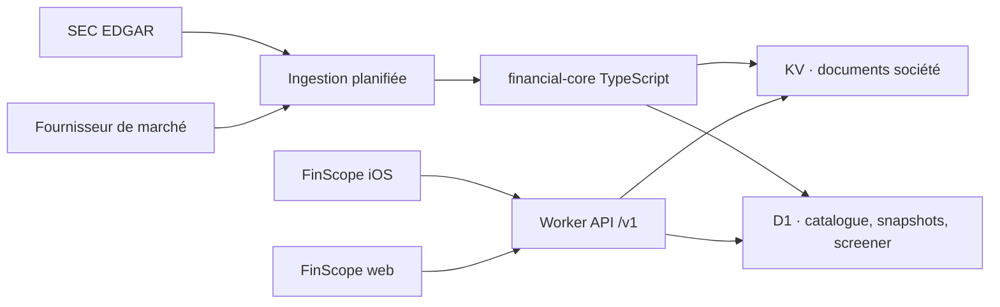

# FinScope iOS — audit de faisabilité et plan de migration

> Audit du 4 septembre 2026. Ce document prépare la nouvelle direction iOS sans lancer la migration. L’audit web historique reste dans `AUDIT_FINSCOPE.md` et n’a pas été modifié.

## Verdict exécutif

La migration est réaliste, mais **FinScope ne doit pas devenir une application Swift qui interroge directement la SEC et recalcule tout sur l’iPhone**. Le bon découpage est hybride :

- conserver le moteur de normalisation, les formules, les validations, le Quality Score et le rafraîchissement planifié en TypeScript côté serveur ;
- transformer progressivement le Worker actuel en **backend produit versionné**, avec des réponses JSON compactes conçues pour le mobile ;
- construire une interface SwiftUI native, en réutilisant sélectivement les fondations de Lume ;
- garder en local sur l’iPhone la présentation, la navigation, la watchlist, les recherches récentes, le cache de lecture et quelques calculs instantanés sans autorité métier ;
- ne pas dépendre d’un fournisseur de données ou d’une clé API embarquée dans l’application.

Cette solution évite une seconde implémentation du moteur financier, préserve l’auditabilité existante et permet à l’app iOS et au site actuel de lire les mêmes chiffres.

### Décision recommandée en une ligne

**Cloudflare Worker + moteur TypeScript existant + KV aujourd’hui + D1 pour l’index et le screener + API REST `/v1` + app SwiftUI iOS 18 inspirée de Lume.**

### Ce qui n’a pas été fait

- Aucun moteur n’a été supprimé ou déplacé.
- Aucun projet iOS FinScope n’a été créé.
- Aucun schéma D1 ni endpoint `/v1` n’a été ajouté.
- Aucun faux jeu de données n’a été introduit.
- Lume n’a pas été modifié ; il contient déjà des changements locaux appartenant à son propriétaire.

---

## 1. État actuel de FinScope

### 1.1 Nature du projet

FinScope est une application de recherche financière web complète, pas seulement un prototype d’interface. Elle contient déjà quatre couches utiles à la future app :

1. des adaptateurs de données externes ;
2. un moteur de normalisation des périodes et faits financiers ;
3. des fonctions financières pures et un moteur Quality Score ;
4. des routes serveur et des caches Cloudflare.

L’interface React est donc la partie la moins stratégique à conserver. La valeur principale est dans `lib/`, les tests et les règles de provenance.

### 1.2 Stack et état vérifié

| Élément | État constaté |
|---|---|
| Runtime et langage | Node.js 22+, TypeScript strict, JavaScript pour le moteur QS historique |
| Web | React 19, sémantique Next.js App Router via Vinext/Vite |
| Backend | Cloudflare Worker avec 11 routes API |
| Visualisation web | Recharts 3 |
| Validation | Zod sur les principaux payloads externes |
| Cache serveur | Cloudflare KV via `DATASET_CACHE` |
| Base relationnelle | Drizzle/D1 présent comme squelette, mais `d1: null` et schéma vide |
| Stockage objet | R2 non configuré |
| État du dépôt | propre avant la création de ce rapport |
| Vérification du 04/09/2026 | 644 tests passent, 2 sont ignorés ; TypeScript strict et ESLint passent |

Le dépôt contient actuellement 27 fichiers sous `components/`, 54 sous `lib/`, 46 fichiers de tests Vitest et 11 routes sous `app/api/`.

### 1.3 Pipeline des données

Le flux principal est le suivant :

```text
SEC Company Facts / Submissions
            ↓
lib/adapters/sec.ts
            ↓
normalisation annual / quarter / TTM dans lib/periods.ts
            ↓
CompanyDataset + provenance + validation
            ↓
formules de lib/finance.ts et contrôles de qualité
            ↓
dataset complet KV + résumé compact KV
            ↓
routes API → interface React
```

Les données de marché proviennent des interfaces publiques Yahoo utilisées par les adaptateurs `yahoo.ts`, `quotes.ts` et `intraday.ts`. Elles sont mises en cache séparément selon qu’une observation est encore mobile ou définitivement clôturée.

### 1.4 Moteurs de calcul existants à préserver

Les composants suivants ont une vraie valeur métier et doivent rester la source de vérité initiale :

- `lib/adapters/sec.ts` : récupération SEC, sélection de concepts, formulaires 10-K/10-Q/20-F/40-F, résolution des faits ;
- `lib/periods.ts` : périodes annuelles, trimestres directs ou dérivés, fenêtres TTM et cohérence des durées ;
- `lib/finance.ts` : FCF, marges, données par action, CAGR daté, ROIC, NOPAT, capital investi, retours, dette et multiples ;
- `lib/data-quality.ts` et `lib/accounting-invariants.ts` : validation et statut des valeurs ;
- `lib/market-basis.ts` et `lib/valuation-history.ts` : base de nombre d’actions, capitalisation et historique de valorisation ;
- `lib/growth-quality.ts`, `lib/company-statistics.ts`, `lib/series-analysis.ts` : croissance, cohérence et statistiques ;
- `lib/dcf.ts`, `lib/dcf-foundation.ts`, `lib/fcf-yield-model.ts` : outils de valorisation à reprendre après le MVP ;
- `lib/qs/*` et `lib/qs-export.ts` : Quality Score et préparation des entrées du screener ;
- les tests associés, qui constituent la meilleure spécification exécutable disponible.

Les formules refusent les divisions invalides, propagent les absences au lieu d’inventer zéro, contrôlent les unités et devises, et conservent la provenance. Ce comportement doit être transmis par l’API, pas réécrit implicitement dans les vues SwiftUI.

### 1.5 Quality Score actuel

Le moteur QS est un port JavaScript du moteur historique Python. Il comporte :

- 4 piliers : Quality, Health, Growth et Value ;
- 23 métriques configurées ;
- un mélange de score relatif et absolu, actuellement 70 % / 30 % ;
- winsorisation, plafonds économiques et exclusion des multiples négatifs ;
- renormalisation des poids lorsque certaines données manquent ;
- seuil de couverture de 75 % pour attribuer une note ;
- notes de A+ à D ou `NR` ;
- 5 règles d’alerte et un score ajusté des alertes ;
- classement global et classement sectoriel lorsque le groupe est assez grand.

Le moteur est déjà testable hors React. En revanche, son entrée applicative actuelle passe encore par une table CSV intermédiaire. Cette forme était adaptée à l’import manuel web, pas à une API mobile typée.

Deux métriques prospectives prévues par la configuration — croissance future du chiffre d’affaires et P/FCF forward — ne sont pas alimentées par FinScope, qui n’a pas de fournisseur d’estimations. Le moteur renormalise les poids disponibles. Il faut rendre cette absence et la couverture explicites dans l’app.

### 1.6 QS Screener actuel

Le screener web :

- peut scorer la watchlist calculée par FinScope ou une table collée/importée ;
- calcule les percentiles sur l’univers complet chargé, puis applique les filtres ;
- propose presets, notes, secteurs, capitalisation, score minimal, alertes, tris et export CSV ;
- persiste sa saisie et ses filtres dans `localStorage` ;
- termine les colonnes de valorisation avec un prix courant côté client.

Ce n’est pas encore un screener global piloté par une base. Sans univers matérialisé côté serveur, l’app iOS devrait télécharger chaque entreprise avant de filtrer, ce qui serait lent, coûteux et instable.

### 1.7 Backend, stockage et rafraîchissement actuels

Le Worker expose notamment :

- `/api/resolve` pour la recherche SEC ;
- `/api/company/{ticker}` pour le dataset normalisé complet ;
- `/api/watchlist` pour les résumés ;
- `/api/price`, `/api/prices` et `/api/market` pour les cours et historiques ;
- `/api/performance`, `/api/indices`, `/api/movers`, `/api/fx` et `/api/freshness`.

Les datasets complets et leurs résumés sont stockés en KV, versionnés et reconstruits par cron à 01:00, 07:00, 13:00 et 19:00 UTC, avec un budget maximal de six reconstructions par exécution. Un dataset peut rester servi sept jours en repli, mais devient éligible au rafraîchissement après vingt heures.

Cette stratégie est pertinente comme cache de documents, mais pas comme index de screener. KV ne convient pas pour filtrer efficacement des milliers de sociétés sur plusieurs colonnes. D1, avec des colonnes et index explicites, est adapté à cette partie.

### 1.8 Limites actuelles qui conditionnent l’iOS

- Les fondamentaux couvrent surtout les déclarants US GAAP de la SEC ; l’IFRS nécessite un adaptateur séparé.
- Les banques, courtiers et autres institutions financières ne peuvent pas être évalués avec toutes les métriques industrielles ; le code neutralise déjà plusieurs calculs.
- Yahoo est une source publique non officielle et peut limiter les requêtes. Une app distribuée nécessite une décision explicite de fournisseur et de droits d’usage.
- Le dataset complet d’une société peut atteindre plusieurs mégaoctets car chaque fait transporte sa provenance. Il est trop lourd comme réponse par défaut mobile.
- Les routes actuelles ne sont pas versionnées et reflètent parfois les besoins internes du site plutôt qu’un contrat client stable.
- Les préférences web, scénarios DCF, portefeuille, watchlist et état du screener vivent dans `localStorage` sans compte ni synchronisation.
- Le premier chargement d’un ticker non mis en cache est coûteux et peut répondre `202` pendant une construction asynchrone.

---

## 2. État actuel de Lume

### 2.1 Fondation technique

Lume est un projet iOS natif exploitable comme référence :

| Élément | État constaté |
|---|---|
| Langage | Swift 6 avec concurrence stricte |
| Cible | iOS 18.0, iPhone et iPad |
| UI | SwiftUI, Observation (`@Observable`), Dynamic Type |
| Navigation | `TabView`, une `NavigationStack` par onglet, routeur central |
| Persistance | SwiftData avec schéma versionné et plan de migration |
| Networking | `URLSession`, client injectable, async/await, retries et rate limiting |
| Graphiques | Swift Charts, sparkline et graphique interactif de cours |
| Sécurité locale | Keychain pour les secrets utilisateur |
| Qualité UI | previews, catalogue FR/EN, vérification des chaînes, tokens et composants |
| Taille | environ 8 688 lignes Swift applicatives et 3 165 lignes de tests |

### 2.2 Architecture constatée

Lume suit une structure simple et pertinente :

```text
App/                 composition, RootView, AppRouter
Core/
  Contracts.swift    modèles et protocoles
  Services/          marché, portefeuille, IA, notifications
  Persistence/       SwiftData, entités, mapping
  Utilities/
DesignSystem/        tokens, formatters, composants
Features/
  <Feature>/
    ViewModels/
    Views/
LumeTests/
```

Les vues sont génériques sur de petits protocoles de ViewModel. Les ViewModels sont `@Observable` et `@MainActor`. Les services concrets sont assemblés dans `AppDependenciesLive`, ce qui permet des previews et tests sans framework d’injection de dépendances.

### 2.3 Ce que Lume fait bien

- navigation typée et liens profonds centralisés ;
- composition manuelle compréhensible ;
- séparation Models / Services / ViewModels / Views ;
- client HTTP injectable et erreurs typées ;
- debounce et annulation de recherche ;
- coalescence des requêtes de cotation simultanées dans un actor ;
- repli sur une cotation périmée plutôt qu’un écran vide ;
- SwiftData versionné et stockage en mémoire pour les tests ;
- design system Apple-first fondé sur les couleurs système ;
- chiffres en police monospacée, transitions numériques, haptique discrète ;
- composants pour cartes, erreurs, chargement, champs, boutons et états vides ;
- Dark Mode, Dynamic Type, VoiceOver et réduction des animations ;
- wrapper unique pour Liquid Glass avec repli Material sur iOS 18–25 ;
- graphiques Swift Charts avec lecture au doigt, `RuleMark`, point sélectionné et résumé d’accessibilité.

### 2.4 Ce qui n’est pas prêt à être repris tel quel

- `AppDependenciesLive` utilise actuellement `MockMarketDataProvider`, pas le fournisseur réel.
- Les modèles `Fundamentals` de Lume sont beaucoup trop limités pour FinScope.
- Le cache `QuoteCache` est en mémoire ; son commentaire prévoit une restauration, mais aucune persistance générale des réponses financières n’est branchée.
- Finnhub et Stooq forment un assemblage spécifique à Lume et ne garantissent ni la profondeur fondamentale ni les droits de redistribution requis par FinScope.
- Le portefeuille, le chat IA, les alertes, les textes légaux, la marque, les assets et les identifiants `lume://` / `com.lume.refresh` sont propres à Lume.
- Le système d’injection avec types associés fonctionne, mais deviendrait lourd si chaque écran FinScope ajoutait un associated type. Il faut rester pragmatique et regrouper les fabriques par feature si la liste grandit.

### 2.5 État de validation de Lume

Le 4 septembre 2026 :

- la cible et ses 186 clés localisées compilent sur le simulateur iPhone 17 Pro, iOS 26.5 ;
- 262 tests passent et 2 échouent dans `AIServiceTests` ;
- les échecs viennent de changements locaux non commitées qui rendent maintenant les backends IA constructibles alors que les tests attendent encore une erreur immédiate ;
- cinq fichiers suivis sont modifiés et `SSETransport.swift` est non suivi.

Cela ne remet pas en cause les fondations utiles à FinScope, mais interdit de traiter la copie de travail actuelle comme un template « vert » sans sélectionner un commit stable ou résoudre d’abord cette divergence dans Lume.

### 2.6 Apport de Rune comme référence d’esprit

Rune confirme une direction visuelle utile : fonds système groupés, valeur ou action principale immédiatement visible, cartes courtes, hiérarchie forte, haptique, transitions discrètes et couleur de marque concentrée sur quelques éléments. Son architecture actuelle comporte cependant plusieurs vues de très grande taille et une orchestration centrale dense. **Rune doit inspirer la sensation et la hiérarchie, pas servir de base de code.**

---

## 3. Ce qui peut être réutilisé

### 3.1 Depuis FinScope

| Élément | Décision | Travail requis |
|---|---|---|
| Normalisation SEC | Conserver | Isoler dans un module serveur stable |
| Modèle de provenance | Conserver | Créer une projection mobile compacte et un endpoint de détail des sources |
| Périodes annual/quarter/TTM | Conserver | Exposer explicitement fréquence et dates dans l’API |
| Formules financières | Conserver | Garder une seule source de vérité serveur |
| Validations et invariants | Conserver | Transformer les statuts en contrat API stable |
| Quality Score | Conserver | Supprimer l’étape CSV pour le pipeline interne, versionner le modèle |
| DCF et outils avancés | Conserver pour plus tard | Ne pas bloquer le MVP avec leur UI |
| Routes marché | Adapter | Versionner, regrouper et sécuriser le contrat |
| KV et crons | Conserver | Séparer cache documentaire et index relationnel |
| Tests métier | Conserver et étendre | Ajouter golden files d’API et tests de non-régression QS |
| Site web | Maintenir pendant la migration | L’utiliser comme référence et outil de validation |

### 3.2 Depuis Lume

| Élément | Réutilisation recommandée |
|---|---|
| `RootView` / `AppRouter` | Reprendre le pattern, renommer les routes et onglets |
| `AppDependencies` | Reprendre la composition manuelle, en évitant une explosion des types associés |
| `HTTPClient` | Reprendre avec headers, décodage, ETag et enveloppe d’erreur FinScope |
| `LoadState` et ViewModels `@Observable` | Reprendre le principe |
| `Theme` | Copier puis créer une identité FinScope ; conserver les tokens système |
| Cartes, headers, erreurs, shimmer, boutons | Réutiliser après renommage et revue visuelle |
| `ValueLabel` et formatters | Adapter aux unités financières, devises, ratios et valeurs absentes |
| `PriceChartView` / `SparklineView` | Réutiliser comme point de départ, pas comme composant fondamental final |
| SwiftData versionné | Reprendre pour watchlist, récents, préférences et cache metadata |
| Previews et fixtures de contrat | Reprendre la méthode ; utiliser des réponses API enregistrées, pas des chiffres fictifs arbitraires |
| Lint UI et String Catalog | Reprendre les garde-fous |

### 3.3 Stratégie de réutilisation

Ne pas faire dépendre FinScope du projet Lume par lien de fichiers. Au démarrage de la phase iOS :

1. choisir un commit Lume stable ;
2. copier uniquement les fondations retenues dans un nouveau namespace FinScope ;
3. remplacer marque, couleurs, localisations, routes et modèles ;
4. conserver un historique clair des adaptations ;
5. n’extraire un package Swift partagé entre Lume et FinScope que plus tard, si les deux apps ont réellement plusieurs composants identiques et stables.

---

## 4. Ce qui doit être abandonné ou réécrit

### À ne pas porter en Swift

- parsing XBRL SEC ;
- logique annual/quarter/TTM ;
- formules financières et gestion des cas limites ;
- Quality Score, percentiles, winsorisation et notes ;
- ingestion planifiée ;
- gestion des secrets fournisseurs.

### À réécrire nativement

- toute l’interface React, le CSS et les composants Recharts ;
- la navigation par query string ;
- le tableau géant du screener ;
- la persistance `localStorage` ;
- les exports et workflows pensés d’abord pour desktop ;
- les états de chargement liés au comportement particulier du site.

### À garder temporairement, puis réévaluer

- le site web comme surface de contrôle et fallback ;
- les routes non versionnées pour ses besoins ;
- l’import CSV du QS Screener web ;
- Portfolio et Charts Workspace, qui pourront inspirer des outils iOS ultérieurs sans entrer dans le premier MVP.

---

## 5. Architecture backend recommandée

### 5.1 Architecture cible



### 5.2 Pourquoi l’hybride est le meilleur choix

| Option | Avantages | Problèmes | Verdict |
|---|---|---|---|
| Tout local Swift | Hors ligne maximal, pas de backend par lecture | Double implémentation, SEC coûteuse, mises à jour lentes, secrets exposés, score divergent | Rejetée |
| Tout serveur, client passif | Cohérence maximale | UX fragile sans réseau, chaque interaction dépend de l’API | Incomplète |
| Hybride | Source de vérité unique + UI réactive + cache hors ligne | Demande un vrai contrat API et une stratégie de cache | Recommandée |

Le calcul local doit se limiter à des transformations de présentation : sélection d’une période déjà reçue, delta visuel entre deux points, formatage, tri local d’un petit résultat déjà scoré. Tout chiffre pouvant apparaître comme « le chiffre FinScope » doit venir du backend avec sa version et sa date.

### 5.3 Organisation serveur proposée

```text
server/
  core/                 modèles, périodes, finance, validation, QS
  providers/            SEC, fournisseur de marché, futur IFRS/estimates
  ingestion/            jobs, cadence, matérialisation
  storage/              KV repositories, D1 repositories
  api/v1/               routes et DTO publics
  web-adapters/          compatibilité temporaire avec les routes actuelles
```

Il n’est pas nécessaire d’introduire Python. Le moteur existant est TypeScript/JavaScript, déployable dans le Worker et déjà couvert par les tests. Un second runtime augmenterait l’exploitation sans bénéfice démontré.

### 5.4 Rôle des stockages

- **KV** : conserver les gros documents JSON de société, les snapshots compacts et les historiques relativement immuables. Bon pour une lecture par clé.
- **D1** : catalogue d’entreprises, dernière période, métriques matérialisées, score et colonnes filtrables du screener. Bon pour filtres, tris et pagination.
- **R2** : inutile au MVP. À envisager seulement pour archiver de gros fichiers bruts ou exports.
- **SwiftData sur l’iPhone** : préférences et données utilisateur, pas source de vérité financière.

Schéma D1 minimal :

```text
companies(id, ticker, name, exchange, country, sector, currency, cik, status)
company_snapshots(company_id, period_end, retrieved_at, data_version, summary_json)
screener_rows(company_id, score_version, universe_version, total, quality,
              health, growth, value, coverage, grade, market_cap,
              revenue_growth, eps_growth, fcf_growth, roic, margins,
              debt_metric, valuation_metric, country, sector, updated_at)
ingestion_runs(id, started_at, finished_at, status, counts_json, error_json)
```

Les colonnes fréquemment filtrées doivent être indexées. Les métriques détaillées et la provenance peuvent rester dans le document KV pour éviter un schéma relationnel démesuré.

### 5.5 API REST mobile proposée

```text
GET /v1/companies/search?q=&cursor=
GET /v1/companies/{ticker}/summary
GET /v1/companies/{ticker}/fundamentals?frequency=annual&metrics=revenue,eps,fcf
GET /v1/companies/{ticker}/score
GET /v1/companies/{ticker}/sources?metric=&period=
GET /v1/quotes?symbols=AAPL,MSFT
GET /v1/screener?minScore=&sector=&sort=&cursor=
GET /v1/data-status
```

Chaque réponse financière doit porter au minimum :

- `schemaVersion` ;
- `dataVersion` ou `scoreVersion` ;
- `asOf` et `retrievedAt` ;
- unités, devise et périodicité ;
- statut `reported`, `calculated`, `restated` ou `unavailable` ;
- avertissements pertinents ;
- un identifiant ou lien permettant de charger la provenance complète à la demande.

Le dataset complet ne doit plus être le payload mobile par défaut. Une fiche doit demander un résumé de quelques dizaines de kilo-octets, puis charger les séries ou sources à la demande.

### 5.6 Sécurité et exploitation

- Aucune clé fournisseur dans le bundle iOS. Une valeur Keychain reste extractible par l’utilisateur de son propre appareil et ne protège pas une clé serveur commune.
- Rate limiting, tailles maximales de requête, curseurs bornés et timeouts sur les endpoints publics.
- Route de reconstruction interne séparée des routes de lecture publiques.
- ETags et `If-None-Match` pour réduire les transferts.
- Logs structurés avec `requestId`, endpoint, cache hit, latence, version de données et erreur amont, sans watchlist utilisateur.
- Alertes sur échec d’ingestion, âge maximal d’un snapshot et taux de `202`/`5xx`.
- CORS conservé pour le web ; HTTPS suffit pour l’app, avec App Attest seulement si l’abus justifie sa complexité.

### 5.7 Coût probable

Pour une petite app, l’infrastructure Cloudflare devrait rester proche du plan Workers Paid, actuellement annoncé à **5 USD/mois minimum**, avec 10 millions de requêtes et 30 millions de millisecondes CPU incluses. D1 inclut actuellement 25 milliards de lignes lues, 50 millions écrites et 5 Go sur le plan payé ; KV inclut 10 millions de lectures, 1 million d’écritures et 1 Go. Ces nombres doivent être revérifiés au moment du lancement.

Le coût dominant et le risque contractuel seront probablement **les données de marché et leurs droits de redistribution**, pas D1. Le coût minimal de distribution Apple est actuellement de **99 USD/an**. Les APIs EDGAR ne demandent pas de clé, mais exigent un accès automatisé conforme et un User-Agent identifiable.

Ordres de grandeur :

- prototype interne : infrastructure existante, potentiellement 0 à 5 USD/mois hors données ;
- petite bêta publique : environ 5 USD/mois Cloudflare si les quotas inclus suffisent ;
- production : 5 USD/mois + fournisseur de marché/licence + observabilité éventuelle ;
- ne pas fixer un budget de données avant d’avoir choisi couverture, délai de cours et droits d’affichage.

Références tarifaires officielles : [Cloudflare Workers, KV et D1](https://developers.cloudflare.com/workers/platform/pricing/), [Apple Developer Program](https://developer.apple.com/programs/whats-included/), [SEC EDGAR APIs](https://www.sec.gov/search-filings/edgar-application-programming-interfaces).

---

## 6. Architecture iOS recommandée

### 6.1 Choix

- Swift 6 ;
- SwiftUI ;
- Swift Charts ;
- Observation avec ViewModels `@Observable` et `@MainActor` ;
- async/await et actors pour les caches/services concurrents ;
- SwiftData pour les données utilisateur et métadonnées persistantes ;
- aucune dépendance tierce au MVP tant qu’un besoin concret ne la justifie.

### 6.2 Arborescence proposée

```text
ios/FinScope/
  App/
    FinScopeApp.swift
    AppRouter.swift
    AppDependencies.swift
  Core/
    Domain/
      Models/
      MetricDefinition.swift
    Networking/
      APIClient.swift
      APIError.swift
      DTO/
    Data/
      CompanyRepository.swift
      ScreenerRepository.swift
      QuoteRepository.swift
      ResponseCache.swift
    Persistence/
      FinScopeSchema.swift
      WatchlistEntity.swift
      RecentSearchEntity.swift
      CachedResponseEntity.swift
    DesignSystem/
      Tokens.swift
      Formatters.swift
      Components/
  Features/
    Home/
    Search/
    StockDetail/
    Screener/
    Watchlist/
    Settings/
  FinScopeTests/
  FinScopeUITests/
```

### 6.3 Responsabilités

- **Views** : composition visuelle et interactions seulement.
- **ViewModels** : état d’écran, annulation, pagination et orchestration de repositories.
- **Repositories** : politique cache-first/network-refresh, mapping DTO → modèles domaine.
- **APIClient** : transport HTTP, décodage, ETag, erreurs et retry borné.
- **Persistence** : watchlist, récents, préférences et copies consultables hors ligne.
- **Domain** : vocabulaire mobile et règles de présentation stables ; pas une copie des formules serveur.

Un état d’écran explicite est préférable à plusieurs booléens : `idle`, `loading`, `loaded(data, freshness)`, `refreshing(data)`, `failed(previousData, error)`.

### 6.4 Où créer l’app

Recommandation initiale : garder le backend et l’app dans le dépôt FinScope, sous `ios/`, afin que les contrats API, fixtures et versions évoluent ensemble. Les outils Node ignoreront le projet Xcode et inversement. Une séparation en deux dépôts ne devient utile que si les cycles de livraison ou les équipes divergent réellement.

---

## 7. Gestion du moteur financier

### Principe

Le serveur reste l’autorité. L’app reçoit des observations déjà normalisées et des métriques déjà calculées.

### Séparation à introduire côté TypeScript

1. rendre les modules métier indépendants de React, `NextResponse` et des bindings Cloudflare ;
2. définir des entrées/sorties pures ;
3. laisser les providers produire les faits bruts ;
4. laisser `financial-core` produire périodes, métriques, qualité et provenance ;
5. laisser les repositories sérialiser KV/D1 ;
6. laisser `/v1` construire des DTO compacts.

### Calculs locaux autorisés

- changement entre deux points déjà fournis ;
- min/max de la série affichée ;
- sélection de plage ;
- formatage et conversions d’unités d’affichage ;
- tri d’une page de résultats.

### Calculs locaux à éviter

- reconstruction TTM ;
- choix de concepts SEC ;
- FCF, ROIC, CAGR officiel, dette, multiples ;
- toute règle de validation ;
- QS et classement de référence.

### Stratégie de parité

Créer un jeu de « golden fixtures » issu de sociétés réelles déjà présentes dans les tests : AAPL, une société déficitaire, une financière, un émetteur étranger, un exercice décalé et un cas de données manquantes. Chaque version du core et de l’API doit produire exactement les valeurs, statuts et arrondis attendus.

---

## 8. Gestion du Quality Score

### 8.1 Source de vérité

Le QS doit être calculé côté serveur et matérialisé avec :

- `scoreVersion` : règles, poids, ancres et seuils ;
- `universeVersion` : entreprises et date de l’univers de comparaison ;
- `fundamentalsAsOf` et `priceAsOf` ;
- scores des quatre piliers ;
- total, note, couverture et alertes ;
- valeurs brutes, scores par métrique, forces et faiblesses ;
- raisons d’indisponibilité.

### 8.2 Stabiliser la sémantique

Le score relatif dépend de l’univers. Pour qu’un score affiché sur la fiche soit le même que dans le screener :

1. publier un univers de référence daté ;
2. scorer toutes les sociétés contre cet univers ;
3. appliquer ensuite les filtres sans recalculer les percentiles ;
4. ne recalculer qu’à une cadence annoncée, par exemple quotidienne après ingestion ;
5. conserver quelques versions pour expliquer un changement de score.

L’univers courant d’une watchlist de 21 sociétés est trop petit pour un produit de screening général. Le MVP peut explicitement s’appeler « univers couvert » ; l’élargissement doit être mesuré avant de promettre le marché entier.

### 8.3 Évolution technique

- ajouter une entrée structurée au moteur QS, sans supprimer le parseur CSV web ;
- exécuter le moteur dans le job de matérialisation, pas dans chaque requête utilisateur ;
- tester la parité CSV ↔ entrée structurée ;
- figer les versions dans D1 ;
- rendre la couverture très visible ;
- décider si les sociétés financières utilisent un modèle QS séparé ou restent `NR` sur les dimensions non comparables.

---

## 9. Gestion du QS Screener

### 9.1 Expérience native proposée

L’écran principal doit être une liste, pas une table :

- barre supérieure avec nombre de résultats et bouton Filtres ;
- chips uniquement pour les filtres actifs ;
- ligne société : ticker, nom court, score, note et deux métriques choisies selon le tri ;
- menu de tri compact ;
- pagination par curseur ;
- tap vers Stock Detail ;
- sélection facultative de deux ou trois sociétés pour une comparaison dédiée.

Les filtres vivent dans une sheet organisée en sections : Score, Taille, Croissance, Rentabilité, Bilan, Valorisation, Géographie. Chaque contrôle affiche l’unité et permet de réinitialiser sa section.

### 9.2 Exécution

- filtres simples et tri côté serveur via D1 ;
- debounce de 250–350 ms ;
- annulation de la requête précédente ;
- réponse paginée de 30–50 lignes ;
- cache court par combinaison de filtres fréquente ;
- dernière page consultée conservée localement pour un repli hors ligne, clairement daté ;
- jamais de téléchargement de tous les datasets pour filtrer sur l’appareil.

### 9.3 Première version réaliste

Commencer avec les champs déjà fiables : Quality Score, capitalisation, croissance revenue/FCF, ROIC, marges, dette, valorisation, secteur. Pays et EPS growth doivent attendre d’être explicitement normalisés et matérialisés s’ils ne sont pas déjà fiables dans l’univers choisi.

---

## 10. Gestion des données et du cache

### 10.1 Serveur

- ingestion SEC planifiée, jamais lancée par l’iPhone ;
- calculs et score matérialisés après une ingestion réussie ;
- ancien snapshot conservé si le nouveau job échoue ;
- swap atomique de l’`universeVersion` publiée ;
- TTL court pour prix, long pour fondamentaux ;
- ETag basé sur version et date ;
- endpoint de statut pour transparence.

### 10.2 Appareil

| Donnée | Stratégie |
|---|---|
| Watchlist | SwiftData, disponible hors ligne |
| Recherches récentes | SwiftData, limite bornée |
| Résumé des sociétés suivies | cache persistant, stale-while-revalidate |
| Dernière fiche consultée | cache persistant avec `asOf` visible |
| Séries annuelles | cache persistant par ticker/version |
| Prix du jour | cache mémoire + courte persistance, timestamp toujours visible |
| Résultats screener | dernière page seulement, repli daté |
| Provenance détaillée | chargée à la demande, non prioritaire hors ligne |

Pour les gros payloads, stocker le JSON compressé comme fichier dans `Application Support` et garder l’index/metadata dans SwiftData est plus simple que de transformer chaque observation en entité SwiftData. La taille du cache doit être bornée, par exemple 50 à 100 Mo, avec éviction LRU ; la watchlist et les préférences ne sont jamais évincées.

### 10.3 Politique hors ligne

L’app démarre avec le dernier contenu valide, affiche « Mis à jour… », puis tente un rafraîchissement. Sans réseau :

- Home, Watchlist et les dernières fiches restent consultables ;
- Search ne cherche que dans un petit catalogue local récent ;
- le screener montre sa dernière page mais désactive les nouveaux filtres réseau ;
- aucune donnée ancienne n’est présentée comme live.

Les Background Tasks iOS sont opportunistes. Elles peuvent rafraîchir une watchlist, mais ne doivent jamais porter l’ingestion ou garantir une heure exacte.

Apple confirme que SwiftData peut servir de cache léger pour des données distantes et un fonctionnement hors ligne partiel : [documentation SwiftData](https://developer.apple.com/documentation/swiftdata).

---

## 11. Structure proposée de l’application

### Home

- en-tête compact avec état des données ;
- watchlist limitée à 4–6 lignes ;
- recherches récentes si elles existent ;
- un raccourci clair vers le screener ;
- aucun carrousel éditorial ou texte de remplissage au MVP.

### Search

- champ natif `.searchable` actif immédiatement ;
- résultats par ticker et nom avec exchange/pays en secondaire ;
- récents avant saisie ;
- états chargement, aucun résultat et erreur distincts.

### Stock Detail

Ordre recommandé :

1. nom, ticker, prix et timestamp ;
2. Quality Score avec couverture ;
3. quatre métriques fortes maximum : croissance, marge, ROIC, FCF ou dette selon disponibilité ;
4. graphique principal sélectionnable ;
5. sections navigables : Growth, Profitability, Cash Flow, Balance Sheet, Valuation ;
6. sources et qualité dans un niveau secondaire.

La page principale ne doit pas présenter toutes les métriques. Chaque section ouvre une vue focalisée avec un graphique, la valeur actuelle, la tendance et quelques observations.

### QS Screener

Liste de résultats, filtres en sheet, tri, comparaison courte et navigation vers la fiche.

### Watchlist

Liste réordonnable, score, cours et une métrique choisie ; pull-to-refresh ; suppression par swipe avec confirmation seulement si nécessaire ; aucun portefeuille ou transaction dans le MVP.

### Settings

Thème, devise d’affichage si elle est supportée sans ambiguïté, sources, méthodologie QS, mentions légales et gestion du cache. Accessible depuis Home plutôt qu’un onglet principal si son usage reste rare.

---

## 12. Navigation proposée

Recommandation : quatre onglets visibles.

```text
Home | Search | Screener | Watchlist
```

Chaque onglet possède sa `NavigationStack`. `StockDetailRoute(ticker)` peut être poussé depuis n’importe lequel. Les réglages sont présentés depuis Home. Les liens profonds deviennent :

```text
finscope://stock/AAPL
finscope://screener?preset=quality
finscope://watchlist
```

Ne pas reproduire les six onglets de la fiche web. Une barre segmentée horizontale avec beaucoup de catégories deviendrait vite un dashboard compressé. Préférer une synthèse verticale et des drill-downs explicites.

---

## 13. Approche recommandée pour les graphiques

### 13.1 Faisabilité Swift Charts

Swift Charts couvre correctement le besoin initial : `LineMark`, `BarMark`, `AreaMark`, `PointMark`, `RuleMark`, axes, annotations, sélection, scroll horizontal, domaine visible et accessibilité. Apple documente la sélection et le scroll natifs dans [Explore pie charts and interactivity in Swift Charts](https://developer.apple.com/videos/play/wwdc2023/10037/) et recommande des graphiques focalisés et accessibles dans [Design an effective chart](https://developer.apple.com/videos/play/wwdc2022/110340/).

Lume prouve déjà dans le code local la lecture tactile avec `ChartProxy`. Pour FinScope, on pourra utiliser l’API de sélection native lorsque son comportement et VoiceOver sont satisfaisants, en conservant un overlay personnalisé seulement si nécessaire.

### 13.2 Système de graphiques proposé

Créer un composant `FundamentalChart` piloté par :

- identité et libellé de métrique ;
- unité et devise ;
- série datée ;
- fréquence ;
- style conseillé ;
- politique de domaine Y ;
- formatteur et résumé d’accessibilité.

Règles :

- une métrique principale par graphique ;
- barres pour flux annuels discrets comme Revenue, EPS et FCF ;
- lignes avec points pour marges, ROIC, multiples et shares outstanding ;
- zéro inclus lorsque le signe et l’amplitude ont un sens ; sinon domaine resserré et annoncé ;
- valeurs négatives visibles, jamais coupées ;
- sélection tactile avec règle verticale, valeur et année ;
- bascule 5Y / 10Y / Max, Annual / TTM seulement lorsque la donnée existe ;
- comparaison limitée à quelques sociétés et même unité ;
- pas de double axe ;
- pas de lissage qui suggère des observations intermédiaires inexistantes ;
- résumé textuel et données navigables par VoiceOver.

### 13.3 Quand Swift Charts ne suffira peut-être pas

Les besoins futurs comme Sankey complexe, workspace multi-panneaux libre, export vectoriel avancé ou très longues séries intraday peuvent demander un composant spécialisé. Ils ne doivent pas dicter l’architecture du MVP. Les graphiques fondamentaux annuels et TTM sont petits et parfaitement adaptés à Swift Charts.

---

## 14. Risques techniques

| Risque | Impact | Réduction recommandée |
|---|---|---|
| Deux moteurs divergent | Chiffres web/iOS différents | Moteur serveur unique, golden tests |
| Contrat API trop proche des types internes | App cassée à chaque évolution | `/v1`, DTO compacts, compatibilité ascendante |
| Datasets trop lourds | Lenteur, mémoire, cache coûteux | projections par écran et chargement progressif |
| Univers QS trop petit ou mouvant | Score peu interprétable | version d’univers, score matérialisé et méthodologie visible |
| Données manquantes renormalisées | Note flatteuse malgré faible couverture | couverture au même niveau visuel que le score |
| Comparaison de secteurs hétérogènes | Classement trompeur | décision explicite global/sectoriel/modèles spécialisés |
| Yahoo rate-limit/licence | Prix indisponible ou risque de distribution | choisir un fournisseur avant bêta publique |
| Normalisation Worker coûteuse | Throttling lors d’un cold start | ingestion planifiée, files bornées, snapshots atomiques |
| Premier ticker à la demande | `202` et attente visible | catalogue de couverture et job asynchrone explicite |
| Cache iOS périmé | Donnée ancienne perçue comme actuelle | `asOf`, états stale, ETag, refresh visible |
| SwiftData utilisé pour tous les faits | Schéma lourd et migrations pénibles | metadata SwiftData + blobs JSON bornés |
| Copie aveugle de Lume | Dette et identité importées | sélectionner composants, renommer, tester |
| Portée produit trop large | MVP retardé | Search + Detail + Charts + QS + Screener + Watchlist seulement |
| Source IFRS et internationales | Couverture promise mais incomplète | déclarer US SEC d’abord, adapter IFRS séparé |
| Accessibilité des graphiques | Données incompréhensibles sans vision | labels, résumé, audio graph, Dynamic Type |

---

## 15. Points nécessitant une décision

Les choix suivants modifient réellement l’architecture ou le calendrier. La valeur recommandée est indiquée en premier.

1. **Cible minimale : iOS 18** — cohérente avec Lume, Swift 6 et les APIs utilisées. Descendre plus bas augmente les branches de compatibilité.
2. **Univers initial : sociétés SEC US couvertes et validées** — ne pas promettre immédiatement Europe/IFRS.
3. **Définition du score : univers de référence fixe, versionné quotidiennement** — ne pas laisser une watchlist personnelle changer les percentiles.
4. **Financières : modèle séparé ou `NR` partiel** — ne pas comparer un courtier à un éditeur logiciel avec le même FCF/ROIC industriel.
5. **Prix : fournisseur sous contrat avant la bêta publique** — Yahoo peut rester un outil de développement/repli interne, pas une décision implicite de production.
6. **Compte utilisateur : aucun au MVP** — watchlist locale, synchronisation CloudKit facultative plus tard.
7. **Positionnement Home/Watchlist : quatre onglets au départ** — fusion possible après tests d’usage.
8. **Identité : reprendre la sobriété de Lume, pas sa marque ambre/bleu telle quelle** — produire une palette FinScope dédiée.
9. **Avenir du site : le maintenir comme outil interne pendant la migration** — décision de retrait seulement après parité.
10. **Monétisation : gratuite/TestFlight au MVP** — un abonnement change auth, entitlements, paywall et backend.

Décisions qui peuvent attendre : compte cloud, DCF mobile, portfolio, alertes, IA, export avancé, iPad optimisé et internationalisation IFRS.

---

## 16. Plan de migration étape par étape

Les durées sont des ordres de grandeur pour une personne expérimentée, sous réserve du choix du fournisseur de marché. Certaines phases peuvent se chevaucher, mais chaque critère de sortie doit rester vérifiable.

### Phase 0 — Audit — terminé

**Livrable :** ce rapport et l’audit web existant.

**Sortie :** moteurs, sources, risques, base Lume et architecture cible identifiés.

### Phase 1 — Isoler le core et définir l’API — 1 à 2 semaines

- séparer le code métier des handlers web ;
- définir les DTO `/v1` et l’enveloppe d’erreur ;
- ajouter golden fixtures et tests de contrat ;
- définir `dataVersion`, `scoreVersion`, statuts et ETags ;
- conserver les routes web existantes.

**Sortie :** Search, Company Summary et Fundamental Series répondent avec des payloads compacts et testés, sans changement de chiffres sur le web.

### Phase 2 — Matérialisation D1 et ingestion robuste — 1 à 2 semaines

- créer migrations Drizzle réelles ;
- indexer catalogue et lignes de screener ;
- matérialiser snapshots et scores dans un job borné ;
- journaliser les runs et publier atomiquement une version d’univers ;
- mesurer CPU, taille et latence.

**Sortie :** filtres et tris s’exécutent sans charger les datasets ; un job échoué laisse l’ancienne version disponible.

### Phase 3 — Base iOS issue de Lume — 1 à 2 semaines

- créer `ios/FinScope` ;
- reprendre routeur, composition, client HTTP, tokens, états et SwiftData sélectionnés ;
- créer identité FinScope, localisations et composants de base ;
- ajouter tests unitaires, previews et pipeline Xcode.

**Sortie :** app vide mais navigable, Light/Dark, Dynamic Type, erreurs et cache testés sur simulateur et appareil.

### Phase 4 — Search + Stock Detail vertical slice — 2 à 3 semaines

- recherche avec debounce et annulation ;
- fiche résumé avec prix, timestamp, QS et métriques essentielles ;
- cache persistant et mode hors ligne partiel ;
- provenance accessible sans surcharger l’écran ;
- deep link stock.

**Sortie :** un ticker réel peut être recherché, ouvert, fermé, rouvert hors ligne et actualisé sans chiffre factice.

### Phase 5 — Système de graphiques — 1 à 2 semaines

- composant `FundamentalChart` ;
- Revenue, EPS, FCF, FCF/share, marges, ROIC, actions et dette ;
- sélection tactile, plages, unités, valeurs négatives et accessibilité ;
- tests visuels/snapshots sur cas réels.

**Sortie :** chaque série prioritaire respecte son unité, sa fréquence, ses trous et son VoiceOver.

### Phase 6 — Quality Score dans la fiche — environ 1 semaine

- carte synthétique ;
- breakdown des piliers ;
- couverture, version, date, forces/faiblesses et méthode ;
- golden tests JS/API/iOS sur fixtures.

**Sortie :** même score dans l’API, le web et l’iOS pour une même version d’univers.

### Phase 7 — QS Screener natif — 2 à 3 semaines

- endpoint paginé et indexé ;
- filtres en sheet, chips actifs et tri ;
- liste native, navigation vers fiche, comparaison courte ;
- cache de dernière page et états vides/erreur ;
- mesure de performance sur l’univers cible.

**Sortie :** réponse perçue rapide, pagination stable et aucune recomputation de score après filtre.

### Phase 8 — Watchlist et polish produit — 1 à 2 semaines

- watchlist SwiftData ;
- Home réelle, récents, réorganisation et pull-to-refresh ;
- haptique, transitions, skeletons, réduction de mouvement ;
- tests utilisateurs sur la hiérarchie Stock Detail.

**Sortie :** parcours quotidien complet sans dépendre du site web.

### Phase 9 — Production et App Store — 2 semaines minimum

- fournisseur de marché et droits validés ;
- politique de confidentialité, mentions, support et disclaimer ;
- rate limiting, monitoring, alertes, budgets CPU et reprise d’ingestion ;
- tests réseau lent/hors ligne, mémoire, énergie et accessibilité ;
- tests d’upgrade SwiftData et compatibilité API N/N-1 ;
- TestFlight, captures, fiche App Store et revue finale.

**Sortie :** aucune clé embarquée, aucun mock dans la composition Release, backend observable, crash-free beta et données datées.

### Calendrier global réaliste

Pour un développeur principal : **12 à 17 semaines** jusqu’à une bêta solide, hors délai commercial de contractualisation des données et hors fonctionnalités avancées. Une première vertical slice Search + Stock Detail peut exister en **4 à 7 semaines** après validation des décisions de la section 15.

---

## MVP recommandé

Inclure :

- Home concise ;
- Search ;
- Stock Detail ;
- 8 à 10 graphiques fondamentaux ;
- Quality Score et détail des piliers ;
- QS Screener sur l’univers réellement couvert ;
- Watchlist locale ;
- cache hors ligne partiel ;
- provenance et fraîcheur accessibles.

Reporter :

- portefeuille transactionnel ;
- DCF interactif complet ;
- workspace multi-sociétés libre ;
- Sankey ;
- alertes push ;
- chat/IA ;
- comptes et synchronisation multi-plateforme ;
- couverture IFRS ;
- import CSV mobile et exports avancés.

## Prochaine action recommandée

Valider d’abord cinq décisions : **iOS 18, univers US SEC, score versionné sur univers fixe, aucun compte au MVP, fournisseur de marché à sélectionner**. La première implémentation doit ensuite être la Phase 1, pas l’écran Home : stabiliser le contrat API avant de dessiner des vues dépendantes d’un payload interne de plusieurs mégaoctets.
